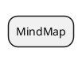

# lsieun.github.io

[](https://jekyllrb.com/)
[](https://lsieun.github.io)

## Run

```shell
bundle exec jekyll serve
```

```shell
bundle exec jekyll serve --unpublished --drafts
```

## Code

```text





```

```text



```

```text





```



```text

```

```html
<table>
    <thead>
    <tr>
        <th style="text-align: center;">Basic</th>
    </tr>
    </thead>
    <tbody>
    <tr>
        <td></td>
    </tr>
    </tbody>
</table>
```

根据 `item.path` 划分目录：

```text

<ol>
    
    
    <li>
        <a href="{{ post.url }}">{{ post.title }}</a>
    </li>
    
</ol>
```

根据 `item.url` 划分目录：

```text

<ol>
    
    
    <li>
        <a href="{{ post.url }}">{{ post.title }}</a>
    </li>
    
</ol>
```

## 课程更新

- [ ] Git仓库的README文件
- [ ] 本网站的`about.markdown`页面的课程列表要更新
- [ ] 本网站的每个课程的页面，要指向视频的地址和代码的地址
