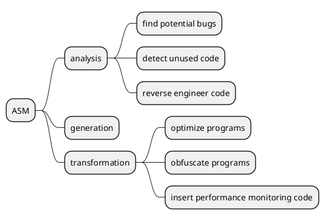

[上级目录]()

## ASM 是什么？

简单来说，**[ASM](https://asm.ow2.io/) 是一个操作 Java 字节码的类库**。

为了能够更好的理解 ASM 是什么，我们需要来搞清楚两个问题：

- 第一个问题，**ASM 的操作对象是什么呢？**
- 第二个问题，**ASM 是如何处理字节码（ByteCode）数据的呢？**

首先，我们来看第一个问题：**ASM 的操作对象是什么呢？** 回答：ASM 所操作的对象是字节码（ByteCode）数据。

我们都知道，一个 `.java` 文件经过 Java 编译器（`javac`）编译之后会生成一个 `.class` 文件。
在 `.class` 文件中，存储的是字节码（ByteCode）数据，如下图所示。
ASM 所操作的对象就是字节码（ByteCode），而在许多情况下，字节码（ByteCode）的具体表现形式是 `.class` 文件。


---

接着，我们来看第二个问题：**ASM 是如何处理字节码（ByteCode）数据的呢？** 回答：ASM 处理字节码（ByteCode）的方式是“拆分－修改－合并”。

ASM 处理字节码（ByteCode）数据的思路是这样的：

- 第一步，将 `.class` 文件拆分成多个部分；
- 第二步，对某一个部分的信息进行修改；
- 第三步，将多个部分重新组织成一个新的 `.class` 文件。

在 [Wikipedia](https://en.wikipedia.org/wiki/ObjectWeb_ASM) 上，对 ASM 进行了如下描述：

<div class="w3-panel w3-light-grey w3-border w3-round">
<p>
ASM provides a simple API for decomposing( 将一个整体拆分成多个部分 ), modifying( 修改某一部分的信息 ),
and recomposing( 将多个部分重新组织成一个整体 ) binary Java classes (i.e. ByteCode).
</p>
</div>

## ASM 的过去和现在

### ASM 的过去

对于 ASM 的过去，主要说明三个问题：

- 第一个问题，ASM 从什么时候开始出现的？
- 第二个问题，ASM 的作者是谁？
- 第三个问题，ASM 的名字有什么含义？

在**2002 年**的时候，**Eric Bruneton**、Romain Lenglet 和 Thierry Coupaye 发表了一篇文章，
名为《[ASM: a code manipulation tool to implement adaptable systems](/assets/pdf/asm-eng.pdf)》。
在这篇文章当中，他们提出了 ASM 的设计思路。

一般来说，大写字母的组合，可能是多个单词的缩写形式，例如，JVM 表示“Java Virtual Machine”。
但是，ASM 并不是多个单词的首字母缩写形式。在上面的文章中，记录了下面的话：

> The ASM name does not mean anything: it is just a reference to the `__asm__` keyword in C,
> which allows some functions to be implemented in assembly language.

### ASM 的现在

对于 ASM 的现在，主要说明两个问题：

- 第一个问题，ASM 属于哪一个机构？
- 第二个问题，ASM 的 Logo 是什么样的？

The ASM library is a project of the [OW2 Consortium](https://www.ow2.org/).
OW2 is an independent, global, **open-source software community**.

作为一个小故事，我们来说一下 OW2 组织是如何形成的。
OW2
组织的形成，与中国的一些大学和公司也有很大的关系（原文内容来自 [ 这里 ](https://www.ow2.org/view/About/OW2_Introduction)）：

- 2002 年，ObjectWeb 项目启动，它是由 INRIA、Bull 和 France Telecom 共同开发的项目，并形成了一个成熟的、开源软件社区。
- 2004 年，Orientware 项目启动，由中国的北京大学、北航、国防科技大学、中创软件和中国科学院软件研究所共同研发。
- 2005 年，ObjectWeb 和 Orientware 签署了一份协议，决定共享代码库，一起开发中间件软件。
- 2006 年，ObjectWeb 和 Orientware 两个社区组织融合，形成了 OW2 组织。OW2 组织名字，
  可能是由**O**bject**W**eb 和**O**rient**w**are 名称当中的两组 `O` 和 `W` 组合而来。

ASM 的 Logo 设计很有特点，它在旋转的过程中，会分别呈现出“A”、“S”和“M”这三个字母，如下图所示：


<style>
    .container {
        width: 200px;
        height: 200px;
        margin: 16px auto;
        perspective: 100000px;
        transform: scale3d(0.5, 0.5, 0.5);
    }

    #asm-logo-3d {
        width: 100%;
        height: 100%;
        position: absolute;
        transform: translateZ(-100px) rotateX(-35.264deg) rotateY(-45deg);
        transform-style: preserve-3d;
    }

    #asm-logo-3d div {
        display: block;
        position: absolute;
        transform-origin: 0 0;
        transform-style: preserve-3d;
    }

    .a-front {
        transform: translate3d(0, 0, 0);
    }

    .a-middle {
        transform: translate3d(0, 0, -80px);
    }

    .a-back {
        transform: translate3d(0, 0, -160px);
    }

    .a-block1.front {
        width: 160px;
        height: 40px;
        transform: translate3d(0, 0, 100px);
    }

    .a-block1.left {
        width: 40px;
        height: 40px;
        transform: translate3d(0, 0, 60px) rotateY(-90deg);
    }

    .a-block1.top {
        width: 200px;
        height: 40px;
        transform: translate3d(0, 0, 60px) rotateX(90deg);
    }

    .a-block1.bottom {
        width: 160px;
        height: 40px;
        transform: translate3d(0, 40px, 100px) rotateX(-90deg);
    }

    .a-block1.back {
        width: 160px;
        height: 40px;
        transform: translate3d(0, 40px, 60px) rotateX(180deg);
    }

    .a-block2.front {
        width: 40px;
        height: 200px;
        transform: translate3d(160px, 0, 100px);
    }

    .a-block2.left {
        width: 40px;
        height: 120px;
        transform: translate3d(160px, 40px, 60px) rotateY(-90deg);
    }

    .a-block2.right {
        width: 40px;
        height: 200px;
        transform: translate3d(200px, 0, 100px) rotateY(90deg);
    }

    .a-block2.back {
        width: 40px;
        height: 200px;
        transform: translate3d(160px, 200px, 60px) rotateX(180deg);
    }

    .a-block3.front {
        width: 160px;
        height: 40px;
        transform: translate3d(0, 160px, 100px);
    }

    .a-block3.top {
        width: 120px;
        height: 40px;
        transform: translate3d(40px, 160px, 60px) rotateX(90deg);
    }

    .a-block3.bottom {
        width: 200px;
        height: 40px;
        transform: translate3d(0, 200px, 100px) rotateX(-90deg);
    }

    .a-block3.back {
        width: 160px;
        height: 40px;
        transform: translate3d(0, 200px, 60px) rotateX(180deg);
    }

    .a-block4.front {
        width: 40px;
        height: 40px;
        transform: translate3d(0, 120px, 100px);
    }

    .a-block4.left {
        width: 40px;
        height: 120px;
        transform: translate3d(0, 80px, 60px) rotateY(-90deg);
    }

    .a-block4.right {
        width: 40px;
        height: 40px;
        transform: translate3d(40px, 120px, 100px) rotateY(90deg);
    }

    .a-block4.back {
        width: 40px;
        height: 40px;
        transform: translate3d(0, 160px, 60px) rotateX(180deg);
    }

    .a-block5.front {
        width: 160px;
        height: 40px;
        transform: translate3d(0, 80px, 100px);
    }

    .a-block5.top {
        width: 160px;
        height: 40px;
        transform: translate3d(0, 80px, 60px) rotateX(90deg);
    }

    .a-block5.bottom {
        width: 120px;
        height: 40px;
        transform: translate3d(40px, 120px, 100px) rotateX(-90deg);
    }

    .a-block5.back {
        width: 160px;
        height: 40px;
        transform: translate3d(0, 120px, 60px) rotateX(180deg);
    }

    .m-block1, .s-block1 {
        width: 40px;
        height: 40px;
    }

    .m-block1.left {
        transform: translate3d(160px, 0, 20px) rotateY(-90deg);
    }

    .m-block1.top {
        transform: translate3d(160px, 0, 20px) rotateX(90deg);
    }

    .m-block1.right {
        transform: translate3d(200px, 0, 60px) rotateY(90deg);
    }

    .m-block1.bottom {
        transform: translate3d(160px, 40px, 60px) rotateX(-90deg);
    }

    .s-block1.left {
        transform: translate3d(0, 0, -60px) rotateY(-90deg);
    }

    .s-block1.top {
        transform: translate3d(0, 0, -60px) rotateX(90deg);
    }

    .s-block1.right {
        transform: translate3d(40px, 0, -20px) rotateY(90deg);
    }

    .s-block1.bottom {
        transform: translate3d(0, 40px, -20px) rotateX(-90deg);
    }

    .front.out {
        background: rgb(0, 139, 224);
    }

    .left.out {
        background: rgb(0, 119, 192);
    }

    .top.out {
        background: rgb(0, 158, 255);
    }

    .right.out {
        background: rgb(0, 119, 192);
    }

    .bottom.out {
        background: rgb(0, 87, 140);
    }

    .back.out {
        background: rgb(0, 87, 140);
    }

    .front.in {
        background: rgb(224, 84, 0);
    }

    .left.in {
        background: rgb(192, 72, 0);
    }

    .top.in {
        background: rgb(255, 96, 0);
    }

    .right.in {
        background: rgb(192, 72, 0);
    }

    .bottom.in {
        background: rgb(175, 66, 0);
    }

    .back.in {
        background: rgb(192, 72, 0);
    }

    @keyframes show-letters {
        0% {
            transform: translateZ(-100px) rotateX(-35.26deg) rotateY(-45deg);
        }
        16.6% {
            transform: translateZ(-100px);
        }
        21.6% {
            transform: translateZ(-100px);
        }
        33.3% {
            transform: translateZ(-100px) rotateX(-35.26deg) rotateY(-45deg);
        }
        50% {
            transform: translateZ(-100px) rotateX(-90deg);
        }
        55% {
            transform: translateZ(-100px) rotateX(-90deg);
        }
        66.6% {
            transform: translateZ(-100px) rotateX(-35.26deg) rotateY(-45deg);
        }
        83.3% {
            transform: translateZ(-100px) rotateY(-90deg);
        }
        88.3% {
            transform: translateZ(-100px) rotateY(-90deg);
        }
        100% {
            transform: translateZ(-100px) rotateX(-35.26deg) rotateY(-45deg);
        }
    }

    #asm-logo-3d:hover {
        animation-name: show-letters;
        animation-duration: 4s;
    }
</style>

<div class="container">
    <div id="asm-logo-3d">
        <div class="a-front">
            <div class="a-block1 front out"></div>
            <div class="a-block1 left out"></div>
            <div class="a-block1 top out"></div>
            <div class="a-block1 bottom in"></div>
            <div class="a-block1 back in"></div>
            <div class="a-block2 front out"></div>
            <div class="a-block2 left in"></div>
            <div class="a-block2 right out"></div>
            <div class="a-block2 back in"></div>
            <div class="a-block3 front out"></div>
            <div class="a-block3 top in"></div>
            <div class="a-block3 bottom out"></div>
            <div class="a-block3 back in"></div>
            <div class="a-block4 front out"></div>
            <div class="a-block4 left out"></div>
            <div class="a-block4 right in"></div>
            <div class="a-block4 back in"></div>
            <div class="a-block5 front out"></div>
            <div class="a-block5 top in"></div>
            <div class="a-block5 bottom in"></div>
            <div class="a-block5 back in"></div>
        </div>
        <div class="m-block1 left in"></div>
        <div class="m-block1 top out"></div>
        <div class="m-block1 right out"></div>
        <div class="m-block1 bottom in"></div>
        <div class="a-middle">
            <div class="a-block1 front in"></div>
            <div class="a-block1 left out"></div>
            <div class="a-block1 top out"></div>
            <div class="a-block1 bottom out"></div>
            <div class="a-block1 back in"></div>
            <div class="a-block2 front in"></div>
            <div class="a-block2 left in"></div>
            <div class="a-block2 right out"></div>
            <div class="a-block2 back in"></div>
            <div class="a-block3 front in"></div>
            <div class="a-block3 top in"></div>
            <div class="a-block3 bottom out"></div>
            <div class="a-block3 back in"></div>
            <div class="a-block4 front in"></div>
            <div class="a-block4 left out"></div>
            <div class="a-block4 right in"></div>
            <div class="a-block4 back in"></div>
            <div class="a-block5 front in"></div>
            <div class="a-block5 top in"></div>
            <div class="a-block5 bottom in"></div>
            <div class="a-block5 back in"></div>
        </div>
        <div class="s-block1 left out"></div>
        <div class="s-block1 top out"></div>
        <div class="s-block1 right in"></div>
        <div class="s-block1 bottom in"></div>
        <div class="a-back">
            <div class="a-block1 front in"></div>
            <div class="a-block1 left out"></div>
            <div class="a-block1 top out"></div>
            <div class="a-block1 bottom in"></div>
            <div class="a-block1 back out"></div>
            <div class="a-block2 front in"></div>
            <div class="a-block2 left in"></div>
            <div class="a-block2 right out"></div>
            <div class="a-block2 back out"></div>
            <div class="a-block3 front in"></div>
            <div class="a-block3 top in"></div>
            <div class="a-block3 bottom out"></div>
            <div class="a-block3 back out"></div>
            <div class="a-block4 front in"></div>
            <div class="a-block4 left out"></div>
            <div class="a-block4 right in"></div>
            <div class="a-block4 back out"></div>
            <div class="a-block5 front in"></div>
            <div class="a-block5 top in"></div>
            <div class="a-block5 bottom in"></div>
            <div class="a-block5 back out"></div>
        </div>
    </div>
</div>


### ASM 的版本发展

对于 ASM 版本的发展，我们要说明两点：

- 第一点，Java 语言在不断发展，那么，ASM 版本也要不断发展来跟得上 Java 的发展。
- 第二点，在选择 ASM 版本的时候，要注意它支持的 Java 版本，来确保兼容性。

比如说，我们常用的 Java 版本是 8、11 和 17。

- 针对 Java 8 版本，我们需要使用 ASM 5.0 版本，就能正常工作。
- 针对 Java 11 版本，我们需要使用 ASM 7.0 版本，就能正常工作。
- 针对 Java 17 版本，我们需要使用 ASM 9.1 版本，就能正常工作。

当然，我们可以尽量使用较高的 ASM 版本。

| ASM Release | Release Date | Java Support                              |
|-------------|--------------|-------------------------------------------|
| 2.0         | 2005-05-17   | Java 5 language support                   |
| 3.2         | 2009-06-11   | support for the new `invokedynamic` code. |
| 4.0         | 2011-10-29   | Java 7 language support                   |
| 5.0         | 2014-03-16   | **Java 8 language support**               |
| 6.0         | 2017-09-23   | Java 9 language support                   |
| 6.1         | 2018-03-11   | Java 10 language support                  |
| 7.0         | 2018-10-27   | **Java 11 language support**              |
| 7.1         | 2019-03-03   | Java 13 language support                  |
| 8.0         | 2020-03-28   | Java 14 language support                  |
| 9.0         | 2020-09-22   | Java 16 language support                  |
| 9.1         | 2021-02-06   | **JDK 17 support**                        |
| 9.2         | 2021-06-26   | JDK 18 support                            |
| 9.3         | 2022-04-04   | Java 19                                   |
| 9.4         | 2022-10-02   | Java 20                                   |
| 9.5         | 2023-03-24   | Java 21                                   |
| 9.6         | 2023-09-30   | Java 22                                   |
| 9.7         | 2024-03-24   | Java 23                                   |
| 9.7.1       | 2024-10-06   | Java 24                                   |

## ASM 能够做什么

### 通俗的理解

- 父类：修改成一个新的父类
- 接口：添加一个新的接口、删除已有的接口
- 字段：添加一个新的字段、删除已有的字段
- 方法：添加一个新的方法、删除已有的方法、修改已有的方法
- ……（省略）

```java
public class HelloWorld extends Object implements Cloneable {
    public int intValue;
    public String strValue;

    public int add(int a, int b) {
        return a + b;
    }

    public int sub(int a, int b) {
        return a - b;
    }

    @Override
    public Object clone() throws CloneNotSupportedException {
        return super.clone();
    }
}
```

### 专业的描述

ASM is an all-purpose( 多用途的；通用的 ) Java ByteCode
**manipulation**( 这里的 manipulation 应该是指 generate 和 transform 操作 ) and **analysis** framework.
It can be used to modify existing classes or to dynamically generate classes, directly in binary form.

The goal of the ASM library is to **generate**, **transform** and **analyze** compiled Java classes,
represented as byte arrays (as they are stored on disk and loaded in the Java Virtual Machine).




- **Program analysis**, which can range from a simple syntactic parsing to a full semantic analysis,
  can be used to find potential bugs in applications, to detect unused code, to reverse engineer code, etc.
- **Program generation** is used in compilers.
  This includes traditional compilers, but also stub or skeleton compilers used for distributed programming,
  Just in Time compilers, etc.
- **Program transformation** can be used to optimize or obfuscate programs,
  to insert debugging or performance monitoring code into applications, for aspect oriented programming, etc.

小总结：

- **generation**：是从 0 到 1 的操作，是最简单的操作，在第二章进行介绍。
  也就是说，原来什么都没有，经过 generation 操作，会生成一个新的 `.class` 文件。
- **transformation**：是从 1 到 1 的操作，是中度复杂的操作，在第三章进行介绍。
  也就是说，原来有一个 `.class` 文件，经过 transformation 操作，会生成一个新的 `.class` 文件。
- **analysis**：是从 1 到 0 的操作，是最复杂的操作。
  也就是说，原来有一个 `.class` 文件，经过 analysis 操作，虽然有分析的结果，但是不会生成新的 `.class` 文件。

在这里，希望**大家记忆这三个单词：generation、transformation 和 analysis。**因为这三个单词，用**精简、准确**的语言来描述 ASM
能够做什么。

## 为什么要学习 ASM ？

平常，我们使用 Java 语言进行开发，能够解决很多的问题。我们可以把 Java 语言解决问题的范围称之为“Java 语言的世界”。
那么，ASM 起什么作用呢？
**ASM 就是一处位于“Java 语言的世界”边界上的一扇大门；
通过这扇大门，我们可以前往“字节码的世界”。**在“字节码的世界”里，我们会看到不一样的“风景”，能够解决不一样的“问题”。


ASM 往往在一些框架的底层起着重要的作用。
接下来，我们介绍**两个关于 ASM 的应用场景：Spring 和 JDK**。这两个应用场景例子的目的，就是希望大家了解到 ASM 的重要性。

### Spring 当中的 ASM

**第一个应用场景，是 Spring 框架当中的 AOP。**
在很多 Java 项目中，都会使用到 Spring 框架，而 Spring 框架当中的 AOP（Aspect Oriented Programming）是依赖于 ASM 的。
具体来说，Spring 的 AOP，可以通过 JDK 的动态代理来实现，也可以通过 CGLIB 实现。
其中，**CGLib** (**C**ode **G**eneration **Lib**rary) 是在**ASM**的基础上构建起来的，
所以，Spring AOP 是间接的使用了 ASM。
（参考自 [Spring Framework Reference Documentation](https://docs.spring.io/spring-framework/docs/3.0.0.M3/reference/html/index.html)
的 [8.6 Proxying mechanisms](https://docs.spring.io/spring-framework/docs/3.0.0.M3/reference/html/ch08s06.html)）。

### JDK 当中的 ASM

**第二个应用场景，是 JDK 当中的 Lambda 表达式**。
在 Java 8 中引入了一个非常重要的特性，就是支持 Lambda 表达式。
Lambda 表达式，允许把方法作为参数进行传递，它能够使代码变的更加简洁紧凑。
但是，我们可能没有注意到，其实，**在现阶段（Java 8 版本），Lambda 表达式的调用是通过 ASM 来实现的**。

在 `rt.jar` 文件的 `jdk.internal.org.objectweb.asm` 包当中，就包含了 JDK 内置的 ASM 代码。在 JDK 8 版本当中，它所使用的 ASM
5.0 版本。

如果我们跟踪 Lambda 表达式的编码实现，就会找到 `InnerClassLambdaMetafactory.spinInnerClass()` 方法。
在这个方法当中，我们就会看到：JDK 会使用 `jdk.internal.org.objectweb.asm.ClassWriter` 来生成一个类，将 lambda 表达式的代码包装起来。

- LambdaMetafactory.metafactory()  第一步，找到这个方法
    - InnerClassLambdaMetafactory.buildCallSite()  第二步，找到这个方法
        - InnerClassLambdaMetafactory.spinInnerClass()  第三步，找到这个方法

注意：在《[Java ASM 系列二：OPCODE]()》的
第三章中的 [Java 8 Lambda]() 对 Lambda 实现进行了较为详细的介绍。

## 总结

本文主要是对 ASM 进行简单的介绍，希望大家能够对 ASM 有基本的了解，并没有涉及到“技术性”的知识点，因此也不需要“记忆”任何内容，了解一下就够了。

本文内容总结如下：

- 第一点，ASM 所处理对象是**字节码数据**，也可以直观的理解成 `.class` 文件，因此 ASM 并不是针对 `.java` 文件进行处理。
- 第二点，ASM 能够对**字节码数据**进行哪些操作呢？回答：analyze、generate、transform。
- 第三点，ASM 可以形象的理解为“Java 语言世界”边缘上的一扇大门，通过这扇大门，可以帮助我们进入到“**字节码**的世界”。

