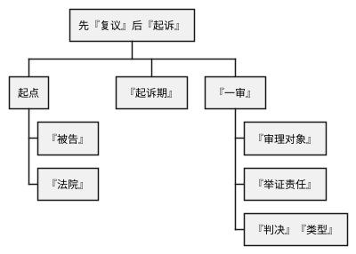

[UP](/law/administration-law-index.html)

## 知识点一



<table>
    <thead>
    <tr>
        <th style="text-align: center;"></th>
        <th colspan="2" style="text-align: center;">『复议』『作为』</th>
        <th rowspan="2" style="text-align: center;">『复议不作为』</th>
    </tr>
    <tr>
        <th style="text-align: center;"></th>
        <th style="text-align: center;">『复议维持』</th>
        <th style="text-align: center;">『复议改变』</th>
    </tr>
    </thead>
    <tbody>
    <tr>
        <th>『被告』</th>
        <td>『共同告』</td>
        <td>『单独告』（『复议机关』）</td>
        <td>『择一告』</td>
    </tr>
    <tr>
        <th></th>
        <td></td>
        <td></td>
        <td></td>
    </tr>
    <tr>
        <th>『法院』（『地域管辖』）</th>
        <td colspan="2">『原机关』『所在地』或『复议机关』『所在地』</td>
        <td>诉『原行为』，『原机关』『所在地』。<br/>诉『复议决定』，『复议机关』『所在地』</td>
    </tr>
    <tr>
        <th>『起诉期』</th>
        <td colspan="2">收到这个『复议决定』文书之日起的『15天』内</td>
        <td></td>
    </tr>
    <tr>
        <th></th>
        <td></td>
        <td></td>
        <td></td>
    </tr>
    </tbody>
</table>

```text
是经过『复议』再『起诉』的几个『难点』

『被告』
是经过『复议』再『起诉』的起点
这也『最重要』的

『复议改变』『单独告』
『复议维持』『共同告』
『复议不作为』『择一告』
```

```text
那么接下来就是我们的『管辖』

『管辖』呢『级别管辖』
是『基层』还是『中院』这个叫『级别』

其实对于那个『改变』和『不作为』没有任何的特别性
因为什么
你比如说以『改变』为例子
500如果『改变』为了300
『孩子』们500都没了
『被告』只有『一个人』『复议机关』了
审的是300了
那谁来『决定』『级别管辖』？『复议机关』
你明白了『被告』就明白了
『复议机关』『决定』『级别管辖』

那『不作为』『择一告』
如果你告『原机关』，『原机关』『决定』它案子的『级别』
『级别管辖』是看『被告』的
你告『复议机关』『不作为』
『复议机关』『决定』『不作为』『案件』的『级别』

那再来我们的特别的是那个『维持』
因为『维持』有『两个』『被告』
比如说一个是『县』『公安局』
它做了的罚500
一个是『县政府』它做了的『维持』
这『两人』共同做『被告』的时候
我们最终确定的『级别』是不一样的
『县公安』来确定那是『基层』
『县政府』来确定那是『中院』
两者确定的『法院』『级别』不一样

因为我们『法条』说的是
『县』『以上』的『政府』这种
『综合性』的是『中院』
而『公安局』『教育局』这种『部门』就是『基层』
所以『维持』之后这俩『被告』
它是不一样的答案

所以谁来确定『级别』？
按『法条』，就低，『原机关』来确定『级别』
为什么就低？
因为如果就高
『一审』『中院』
『二审』『高院』
『再审』『最高院』
案子往上推
上面的『立法者』们受不了嘛
承载不了这么大的『案件』量
所以俩『被告』的时候案子往下压，就低
因此，『原机关』来确定『级别』
```

```text
再来『复习』『地域管辖』

『地域管辖』看『类型』

只要是经过『复议』的
不管你是『维持』、『改变』都是俩『地方』
『原机关』『所在地』或『复议机关』『所在地』

当然是『两个』『地方』的『基层』
还是『两个』『地方』的『中院』
那是『根据』刚才的『级别』来的对吧

只要你经过『复议』
我不管你前面的『被告』是一个『两个』
我不管『级别』是『基层』『中院』
『地域管辖』是非常稳定输出的
就永远是儿子家门口的『法院』
或他爹家门口的『法院』
```

```text
那么继续往下『起诉期』
这个『简单』

如果『复议』是个『作为』
『作为』就是那个收到文书的
『改变』『维持』那种叫『作为』
那就是收到这个『复议决定』文书之日起的『15天』内

那如果『复议』是个『不作为』
『复议』有『审理期』『审理期』多久『60天』
『行政机关』一般做事不是『60天』吗
『两个月』『或者』『60天』嘛
所以等了『60天』没消息
『复议』『审理期』满了
而后的『15天』去『起诉』
61天『开始』

这是我们『改变』『维持』
『不作为』的『起诉期』也学了
```

```text
接着『一审』的『审理对象』
其实有特别的就是『维持』
『维持』那里叫二二二
诉『两个』
审『两个』
判『两个』
『审理』的『对象』俩
『原行为』和『复议维持』对吧

那『改变』不用讲
看我这老『朋友』
500改为300，500都没了
『审理对象』是什么
300的『合法性』

那『不作为』呢？
看你告哪个了
告『原行为』，审『原行为』
不告『不作为』，审『不作为』
```

```text
『举证责任』

『行政法』的『举证责任』你们『知道』
『合法』或『违法』深入的『理由』，都是『被告』的

我先说『两个』『法条』都没说的
因为这『简单』
『改变』和『不作为』

在『复议改变』的『情况』下
是谁对『行政行为』的『合法』或『违法』
承担『举证责任』的？『复议机关』

只要确定了『被告』，剩下的都能顺下来了
『复议改变』『单独告』，『被告』是『复议机关』
谁『决定』『级别管辖』？『复议机关』
『审理对象』是什么？『复议机关』
那谁承担『举证责任』？『复议机关』

那『不作为』呢？
『择一告』，要看你告哪个

所以这里『举证责任』这里
比较特别的依然是那个『维持』
因为『维持』有俩『行为』
那俩『行为』都是谁承担的？

（1）『复议决定』由『复议机关』『证明』
（2）『原行为』，特别的是谁？
『原机关』和『复议机关』

为什么『复议机关』会『证明』『原行为』，与它何干？
你说它好，它不好，你不受牵连吗？
先有『原行为』，之后的『维持』是建立在它的『基础』之上的
我说它好，我说它对
我作了『维持』『决定』
『法院』说好个屁
『原行为』『被撤销』了
『维持』会受牵连
所以『复议机关』对『原行为』也需要『证明』『原行为』
```

```text
『判决』

『判决』『维持』了二二二
诉『两个』
审『两个』
判『两个』
既需要对『原行为』
也需要对『维持』作『判决』

再来『改变』呢
500改为800
『违法』的『改变』加重了
但是『坏人』也是『人』
『违法』的『改变』也是『改变』
那回头我『法院』把800给『撤销』了
那『要求』对这事从新『处罚』的话
『要求』『原机关』还是『复议机关』重做？
『复议改变』自始至终都是『复议机关』
『唯一』的『被告』是『复议机关』
你不可能给『案外人』『附加义务』的

如果你是『维持』
有俩个『被告』的时候
干活的是『原机关』没错
但是『改变』了之后
你撤了『复议机关』的800
『要求』重做，谁重做？『复议机关』

你看我为什么放慢速度了
我『知道』你会错的

接着那如果『法院』认为800也不对
500也不对
就『要求』『复议机关』重做

但是你看讲义如果
『法院』认为500正正好呢
与其重做，浪费『时间』
不是还是做一500吗
为了提高『效率』，怎么办？
『恢复』『原行为』的『效力』
```

```text
好这个表归纳的挺好多『熟悉』『熟悉』

『没问题』

这是『行政法』从『理解』性上『最难』的点了

真的是极难的
```
