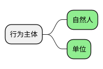
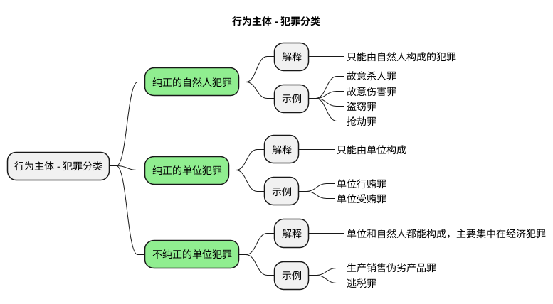

[UP](/law/criminal-law-index.html)


## 行为主体分类



根据“行为主体”，刑法规定的 400 多条罪行，可以分成三大类：



## 自然人


### 身份犯

### 国家工作人员

<table>
    <thead>
    <tr>
        <th style="text-align: center;">身份</th>
        <th style="text-align: center;">贪钱（单位的钱，占为己有为目的）</th>
        <th style="text-align: center;">挪钱（单位的钱，没有非法占有目的）</th>
        <th style="text-align: center;">收钱（别人的钱）</th>
    </tr>
    </thead>
    <tbody>
    <tr>
        <td>国家工作人员</td>
        <td>贪污罪</td>
        <td>挪用公款罪</td>
        <td>受贿罪</td>
    </tr>
    <tr>
        <td>非国家工作人员</td>
        <td>职务侵占罪</td>
        <td>挪用资金罪</td>
        <td>非国家工作人员受贿罪</td>
    </tr>
    </tbody>
</table>

三个概念范围的大小：

```text
国家工作人员（最大） > 国家机关工作人员 > 司法工作人员（最小）
```

## 单位


### 单位犯罪成立条件

* 如果是国有单位，不要求法人资格（否），可以构成单位犯罪；
* 如果是私人单位，要求法人资格（是），可以构成单位犯罪；
* 如果是合伙，没有法人资格（否），不能构成单位犯罪；
* 单位（国有和私有，不包括合伙）的分支机构，它没有独立法人资格，是否可以成为单位犯罪的主体？
    * 分公司，它没有独立法人资格，需要满足两个条件，才能构成单位犯罪
        * 第一，以自己的名义去犯罪
        * 第二，违法所得，归这个分支机构所有
    * 子公司，有独立法人资格，可以构成单位犯罪
    * 合伙的分支机构，也不构成单位犯罪。

### 单位犯罪惩罚

## 对比

### 单位犯罪和自然人犯罪的关系

```text
单位犯罪是单位本身的犯罪，不是各个成员个人的共同犯罪，也不是单位与成员个人的共同犯罪。
```


