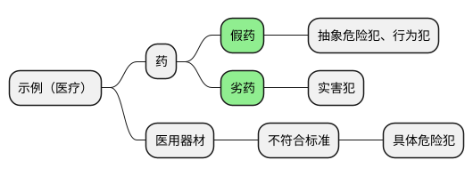
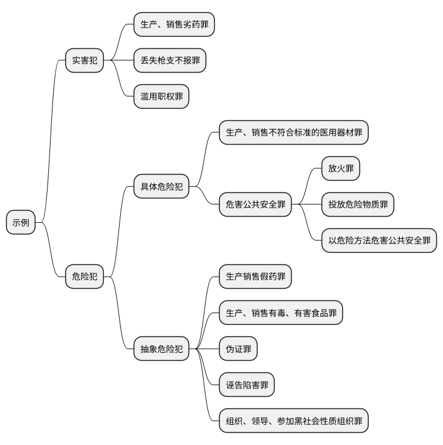
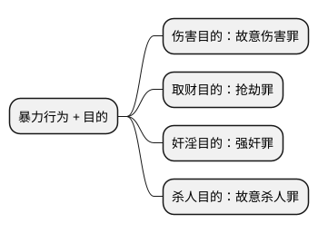

[UP](/law/criminal-law-index.html)


## 法益侵害事实的分类


```text
所有的**过失犯罪**，都是**实害犯**。
因为立法者规定，成立所有的过失犯罪，都要求造成实害结果。
```





## 结果加重犯

```text
考试：重点、难点，几乎年年考
```

```text
案例：鲁智深拳打镇关西
定罪：“故意伤害罪 过失致人死亡罪”
```

```text
结果加重犯，
有两个结果加重犯里面的致人死亡是包括『被害人自杀』的，
一个是『虐待罪』致人死亡，
另一个就是『暴力干涉婚姻自由罪』致人死亡。
```


### 第一个考点：法定性


### 第二个考点：一个行为

### 第三个考点：因果关系

```text
客观题，主要是考判断标准；
那么，判断标准，一定要掌握具有通用型的判断标准。
```

```text
**行为**与**目的**同时存在原则

一个行为，它的定性，是由目的决定的。
一个暴力行为，它可以成为 N 多罪的实行行为，那它到底怎么定性呢？是由**目的**决定的。
```


