[UP](/law/criminal-law-index.html)


```text
考点：因果关系，每年的重点 + 难点
```

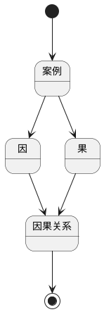

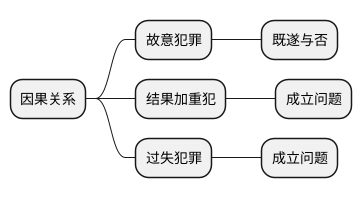

## “因”要求

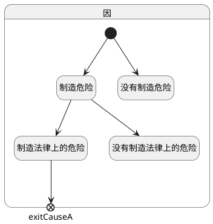

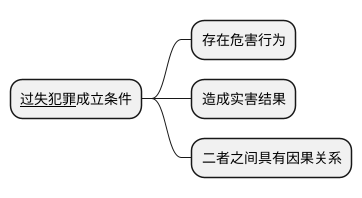

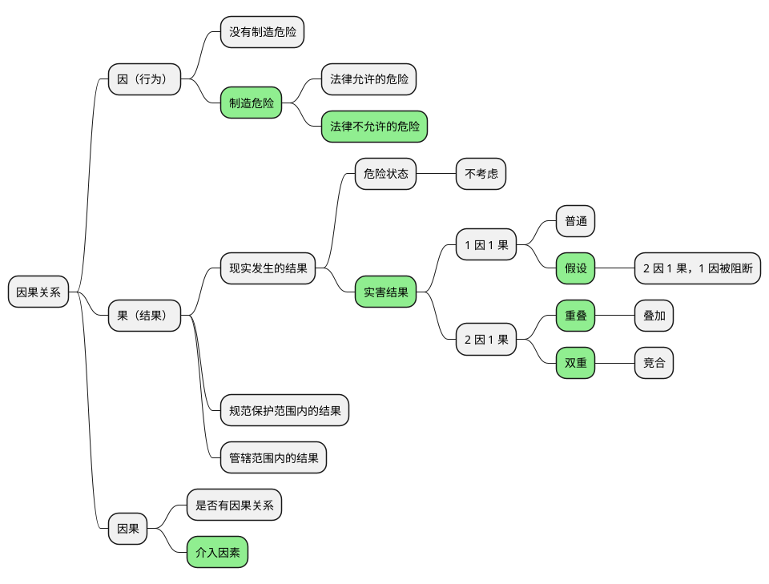

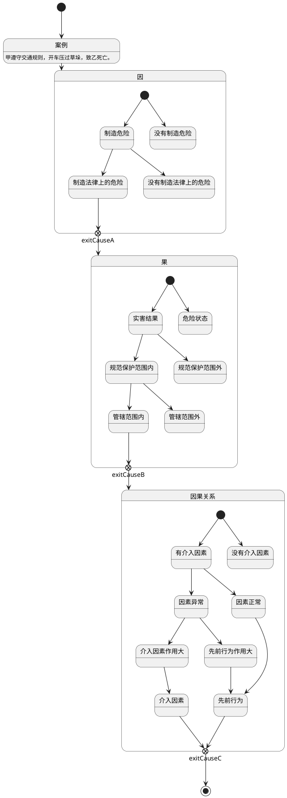


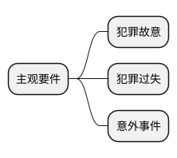

## “果”的要求

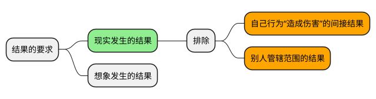

### 现实发生的结果

```text
经典案例：死刑犯，执行死刑前 5 分钟，被害人的父亲杀了他。
```

```text
构成故意杀人罪，
因为，剥夺了这个死刑犯 5 分钟的生命。
5 分钟，的确，是很短的时间，
但是，我们的生命就是由一分一秒组成的。
```

```text
假设的因果关系（不杀，5 分钟之后也会死），法律上不采纳，
只采纳现实的因果关系（被害人父亲杀了死刑犯）。
```

### 规范和保护范围内的结果

### 管辖范围内的结果

## 因果关系

```text
我的理解
因果关系 = 负责 = 负刑事责任 = 判刑坐牢
```

### 分类：因果的数量

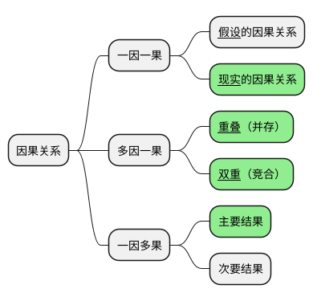

### 分类：因果的解释学说

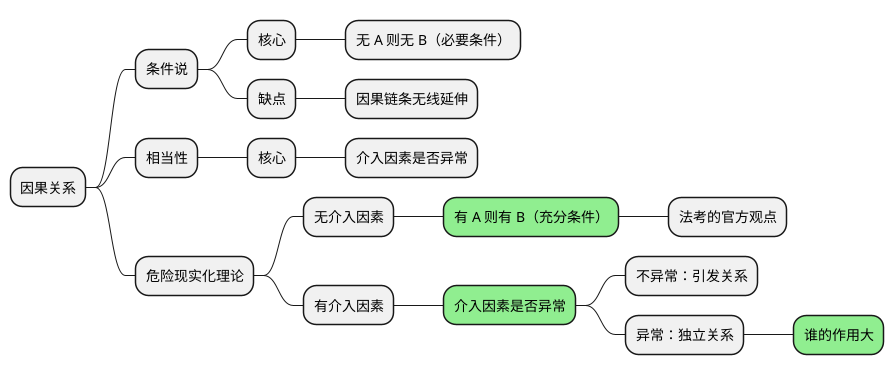

#### 条件说

```text
无 A 则无 B

滑坡论证，导致因果链条无限延伸

向前延伸：
小芳受伤，是因为狗蛋拿刀砍小芳；
狗蛋拿刀砍小芳，是因为狗蛋妈生了狗蛋；
……

向后延伸：
不好好学习，就考不上大学；
考不上大学，就找不到工作；
找不到工作，就娶不到媳妇；
……
这被子就完了
```

#### 相当因果关系说

#### 危险的现实化理论

```text
有 A 则有 B
```

### 推定因果关系：直接

```text
因果关系分析：有 A 则有 B
```

### 推定因果关系：介入因素

```text
介入因素，是指对法益制造危险的因素。
```

```text
原则上，犯罪人犯罪之后，被害人自杀身亡，
那都跟前面的犯罪人没有因果关系。

例外：暴力干涉婚姻自由罪致人死亡、虐待罪致人死亡
```

#### 介入因素两步走标准

```text
存在**介入因素**的案件中，危险现实化理论的判断重点是，
结果是**先前行为**制造的危险的现实化结果，
还是**介入因素**制造的危险的现实化结果，
抑或**二因一果**。
```


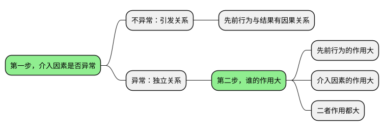

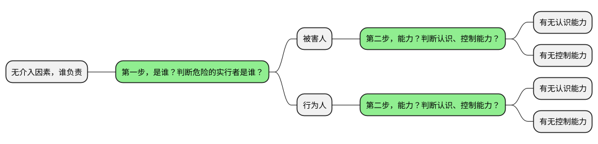

#### 介入因素分类

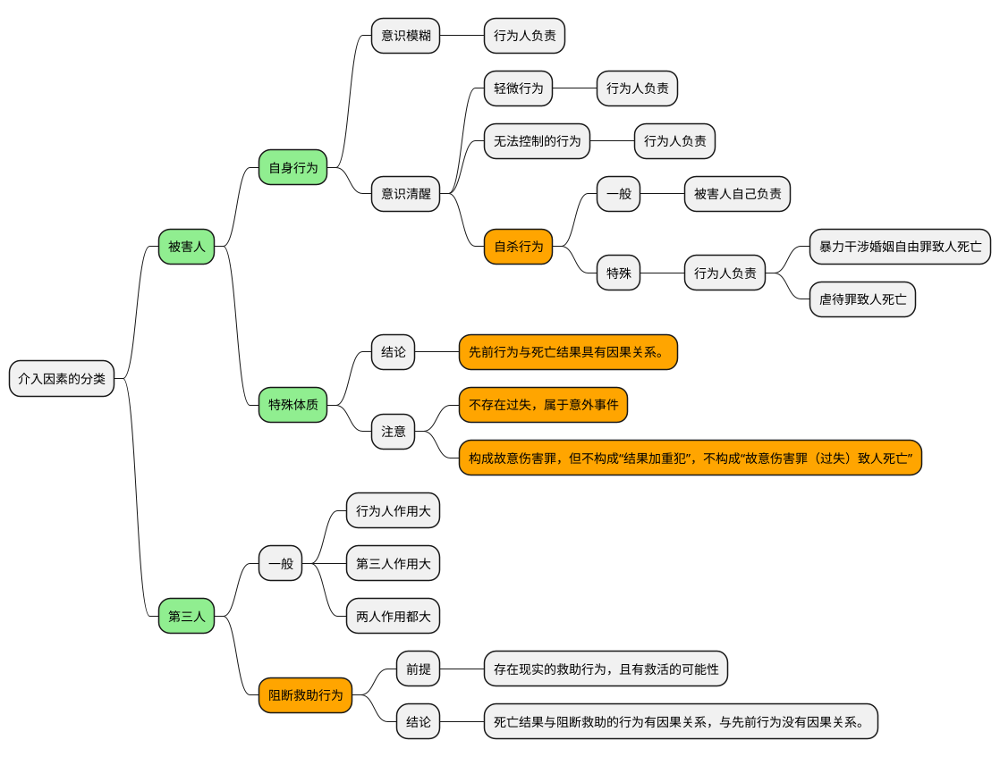

#### 第三人 - 阻断救助行为

```text
案例：救生圈
```

```text
如果有救助行为，
那么，死亡结果，应当算到**阻断救助行为**的头上。
```

#### 被害人 - 特殊体质

- 引发关系
- 独立关系

```text
**疾病**本身不是介入因素，
**疾病的发作**是介入因素。
```

## 无法查明的案件

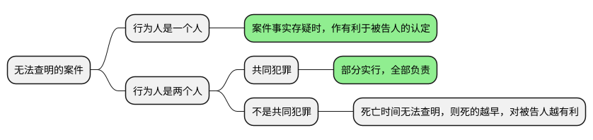

- 一般化
- 具体化


## 对比

### 因果关系：民事和刑事

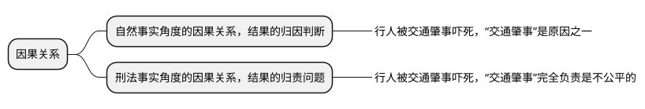

```text
刑法认定**因果关系**，跟民法有一个很大的区别：

民法认定因果关系，它最后认定的是“赔偿责任”，
民法的“赔偿责任”，可以三七开、二八开，
可以说谁是主要责任，谁是次要责任，就是赔钱多少的问题；

刑法的刑事责任是没法划分的，
不区分“谁是主要责任、谁是次要责任”，
要么有刑事责任，要么没有刑事责任。
有刑事责任，就要坐牢。
因此，刑法的因果关系的认定，就更严格。
```

### 因果关系和刑事责任

```text
有**因果关系**，不等于有**刑事责任**。
确定**因果关系**，只是解决了犯罪**客观要件**的问题；
行为人是否承担**刑事责任**，还需要看是否具备**主观要件**。
```

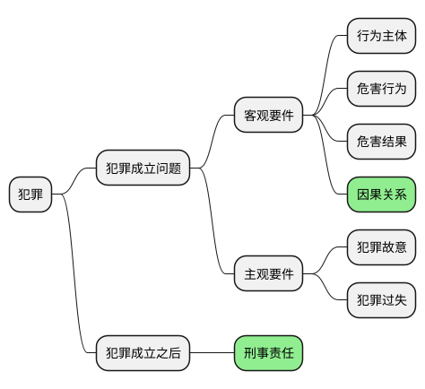
