[UP](/law/criminal-law-index.html)


```text
考点：正当防卫，是最重要的五星级考点
```

## 概览

### 两阶层犯罪构成体系视角


```text
要先通过“客观要件”（行为主体、危害行为、危害结果、因果关系）的检查，四个都打勾，
才能进一步考虑“客观违法阻却事由”（正当防卫、紧急避险、被害人承诺）的部分。
```

## 防卫分类

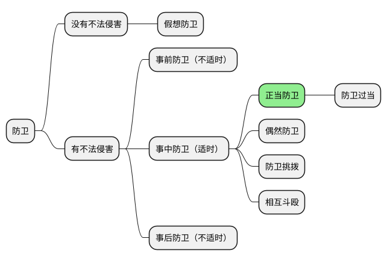

## 正当防卫

```text
凡是成立“正当防卫”，都要求制止“不法侵害”。（这是对的）

凡是制止“不法侵害”的行为，都是“正当防卫”。（这是错的）
```

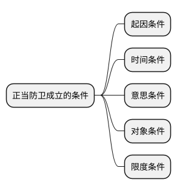

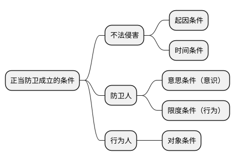

### 起因条件

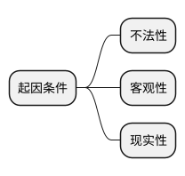

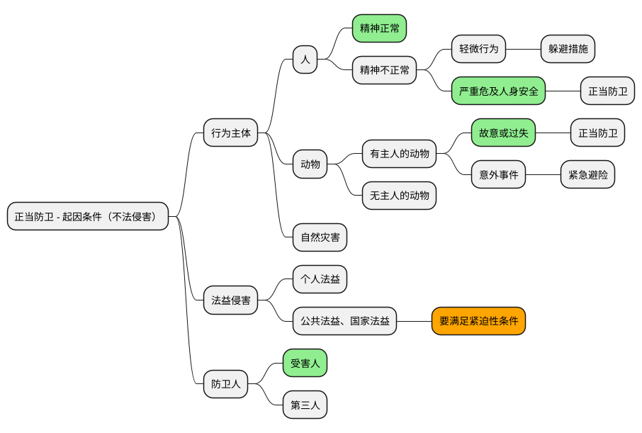

```text
正当防卫，必须对应者“不法侵害”的存在。
```

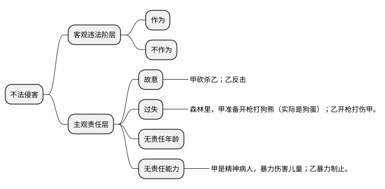

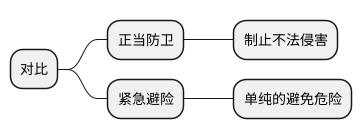

#### 现实性

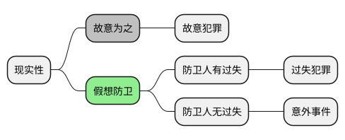

### 时间条件

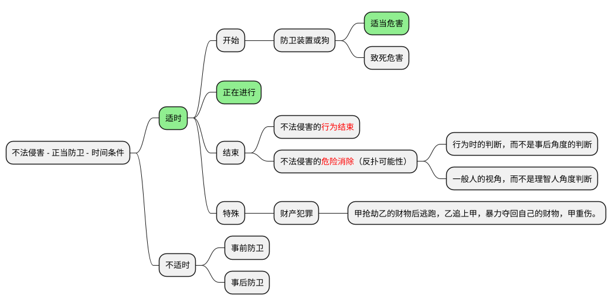

### 意思条件

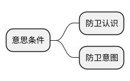

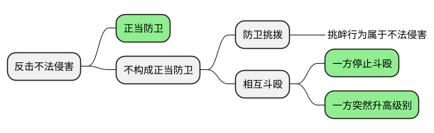

#### 偶然防卫（考点）

```text
专门整理
```


#### 防卫挑拨


#### 相互斗殴

```text
斗殴无防卫
斗殴有承诺，承诺有限度。
```

### 对象条件

```text
杜甫《前出塞九首》
挽弓当挽强，用箭当用长。
射人先射马，擒贼先擒王。
杀人亦有限，列国自有疆。
**苟能制侵陵，岂在多杀伤。**
```

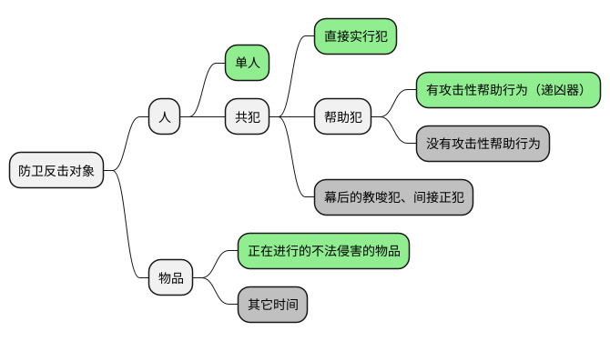

### 限度条件

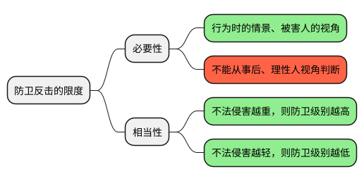

#### 防卫过当

```text
防卫过当，应当负刑事责任，但应当减轻或免除处罚。
```

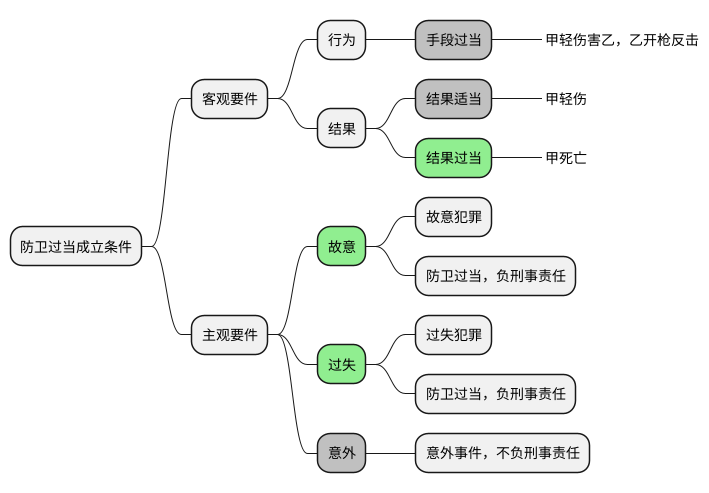

```text
故意杀人罪
故意伤害罪（重伤）
过失致人死亡罪
过失致人重伤罪
```

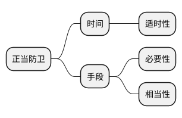

### 最厉害得正当防卫


### 总结

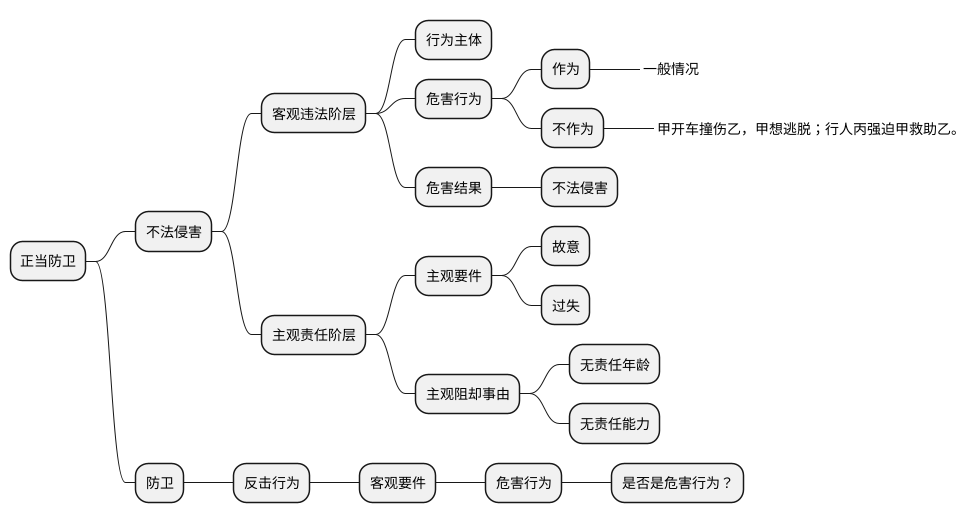

## 紧急避险

```text
避免危险
```

## 被害人承诺


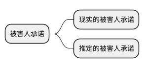

### 现实的被害人承诺


#### 承诺的权限与范围


#### 承诺时间

```text
事后承诺于事无补
```

```text
案例：甲睡觉，乙偷摸甲，是否构成强制猥亵罪？

第 1 种情况，甲故意假装睡觉，乙偷摸甲，不够成。

第 2 种情况，甲真睡觉，乙偷摸甲，甲醒了，看乙很帅，默许乙继续偷摸。
分成两个阶段，
第一阶段，甲真睡觉，构成；
第二阶段，甲睡醒之后，不构成。
```

#### 承诺的能力

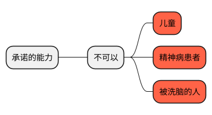

#### 承诺的意思表示

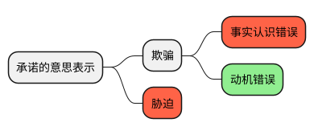
