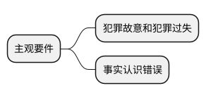
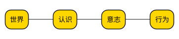
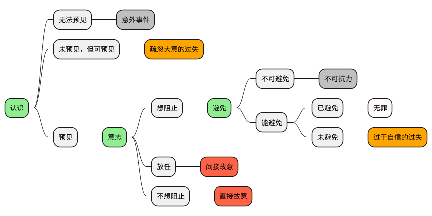
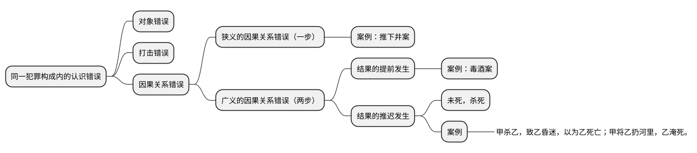

[UP](/law/criminal-law-index.html)




```text
认识 → 意志 → 避免
```




## 犯罪故意

### 分类


### 判断标准：主客观相一致原则

```text
犯罪故意的原则，叫主客观相一致原则；

过失犯罪，是没有主客观相一致原则的。
```


## 罪过形式的区分

### 区分




<table>
    <thead>
    <tr>
        <th style="text-align: center;">罪过形式</th>
        <th style="text-align: center;">认识因素（是否预见）</th>
        <th style="text-align: center;">意志因素（阻止意愿）</th>
        <th style="text-align: center;">行为因素（是否避免）</th>
    </tr>
    </thead>
    <tbody>
    <tr>
        <td>直接故意</td>
        <td>&#x2714;</td>
        <td>&#x2718;</td>
        <td></td>
    </tr>
    <tr>
        <td>间接故意</td>
        <td>&#x2714;</td>
        <td>&#x2718;（放任）</td>
        <td></td>
    </tr>
    <tr>
        <td>过于自信的过失</td>
        <td>&#x2714;</td>
        <td>&#x2714;</td>
        <td>&#x2718;</td>
    </tr>
    <tr>
        <td>疏忽大意的过失</td>
        <td>&#x2718;（有认识可能性）</td>
        <td></td>
        <td></td>
    </tr>
    <tr>
        <td>意外事件</td>
        <td>&#x2718;</td>
        <td></td>
        <td></td>
    </tr>
    <tr>
        <td>不可抗力</td>
        <td>&#x2714;</td>
        <td>&#x2714;</td>
        <td>&#x2718;</td>
    </tr>
    </tbody>
</table>


<table>
    <thead>
    <tr>
        <th style="text-align: center;">罪过形式</th>
        <th style="text-align: center;">结果因素</th>
        <th style="text-align: center;">控制能力</th>
        <th style="text-align: center;">认识因素</th>
        <th style="text-align: center;">意志因素</th>
        <th style="text-align: center;">行为因素</th>
    </tr>
    </thead>
    <tbody>
    <tr>
        <td>不可抗力</td>
        <td>&#x2714;</td>
        <td>&#x274C;&#x274C;</td>
        <td></td>
        <td></td>
        <td></td>
    </tr>
    <tr>
        <td>意外事件</td>
        <td>&#x2714;</td>
        <td>&#x274C;</td>
        <td></td>
        <td></td>
        <td></td>
    </tr>
    <tr>
        <td>疏忽大意的过失</td>
        <td>&#x2714;</td>
        <td>&#x2714;</td>
        <td>&#x274C;</td>
        <td></td>
        <td></td>
    </tr>
    <tr>
        <td>过于自信的过失</td>
        <td>&#x2714;</td>
        <td>&#x2714;</td>
        <td>&#x2714;</td>
        <td>&#x2714;</td>
        <td>&#x274C;</td>
    </tr>
    <tr>
        <td>间接故意</td>
        <td>&#x2714;</td>
        <td>&#x2714;</td>
        <td>&#x2714;</td>
        <td>&#x2757;（放任）</td>
        <td>&#x274C;&#x274C;</td>
    </tr>
    <tr>
        <td>直接故意</td>
        <td>&#x2714;</td>
        <td>&#x2714;</td>
        <td>&#x2714;</td>
        <td>&#x274C;</td>
        <td>&#x274C;&#x274C;</td>
    </tr>
    </tbody>
</table>

### 故意犯罪 Vs 过失犯罪

```text
『故意犯罪』，只要求有『危害行为』就够了，『危害结果』和『因果关系』主要是『故意犯罪』的『既遂』要件而言。
在犯罪构成体系中，『客观要件』，既包含了『犯罪成立』的要件，也包含了『故意犯罪』的『既遂』的要件。
```

#### 基本

- 客观 - 危害结果：过失犯罪，必须是实害结果
- 法律：法律必须明确规定

---

- 过失犯罪成立条件：
    - 第一，过失行为（主观 + 客观）
    - 第二，实害结果（客观）
    - 第三，过失行为和实害结果的因果关系（客观）


#### 判断任务


## 事实认识错误

### 作用

如果行为人存在事实认识错误，
那么需要判断的问题是：

- 行为人是否构成故意犯罪？（是否成立）
- 若成立，是既遂，还是未遂？（是否既遂）


```text
事实认识错误，属于“意识”部分；
故意，属于“意志”部分。

“意识”会影响“意志”和“行为”。

事实认识错误，会影响意志（故意、过失、意外），
也会影响行为（非危害行为、危害行为）。
```

### 影响


### 分类


## 犯罪故意型事实认识错误

### 分类


### 对象错误和打击错误的区分


### 具体的认识错误



### 抽象的认识错误

#### 基本模型

#### 考察角度：包容评价关系

常考的角度（知识点）：

- 人身犯罪
- 财产犯罪

```text

```

## 因果关系错误

```text
考试第一最多：结果的推迟发生
考试第二最多：结果的提前发生
考试第三最多：狭义的因果关系错误
```

### 狭义的因果关系


### 结果的推迟发生


### 结果的提前发生

- 第一步，判断是否着手？
- 第二步，如果已经着手，观点展示
    - 多数说：
    - 少数说：

---

- 前行为是否着手？
    - 尚未着手
        - 故意杀人罪犯罪预备 与 过失致人死亡罪，想象竞合
    - 已经着手
        - 多数说：故意杀人罪既遂
        - 少数说：故意杀人罪未遂与过失致人死亡，想象竞合

### 总结各种错误类型的结合

```text
主要围绕“打击错误” 和 另外一个内容
```

- 打击错误 + 对象错误
- 打击错误 + 狭义因果关系（因果关系）
- 打击错误 + 结果的提前发生（因果关系）
- 打击错误 + 偶然防卫（正当防卫）
