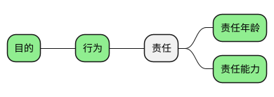
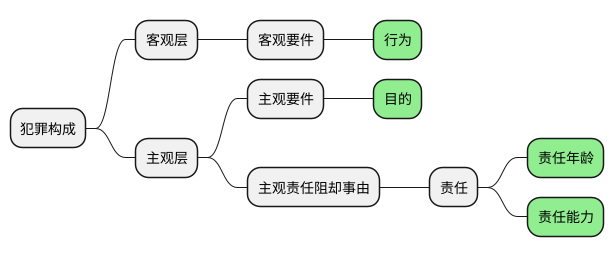

[UP](/law/criminal-law-index.html)


## 责任年龄

```text
考试重点：相对责任年龄（12-14,14-16），12-14 更重要
```


## 责任能力


```text
不要把因果关系搞错了，
努力和成功没有必然的因果关系。
如果付出努力，就必然成功，
如果是这么一个简单的逻辑关系的话，那这个世界的运转其实就不正常了；
努力，只是成功的必要条件，从来就不是成功的充分条件；
机遇、运气，它永远会发挥你想象不到的那种作用。
那我们努力干什么？
努力，主要是给自己一个交代，并不要期望它必然产生号结果。
如果我们对成功的憧憬过于急切的话，
那么，痛苦就在你的心底油然而生。
对于成功，有时候不要太憧憬、太期待。
```

```text
但行好事，莫问前程。
```

### 构件

```text
责任能力 = 辨认能力 + 控制能力
```

### 程度

* 责任能力程度
    * 完全责任能力
    * 相对责任能力
    * 完全无责任能力

### 特殊人群

### 行为与责任同时存在原则



- 行为与目的
- 行为与责任
    - 责任年龄
    - 责任能力



#### 『行为』与『故意』同时存在原则

#### 『行为』与『责任年龄』同时存在原则

#### 『行为』与『责任能力』同时存在原则

```text
考点：最难最重要，行为与责任能力同时存在原则
```

<table>
    <thead>
    <tr>
        <th style="text-align: center;">案例</th>
        <th style="text-align: center;">精神正常阶段</th>
        <th style="text-align: center;">精神失常阶段</th>
        <th style="text-align: center;">定罪</th>
    </tr>
    </thead>
    <tbody>
    <tr>
        <td>案例 1</td>
        <td>甲欲杀乙，邮寄毒酒</td>
        <td>乙死亡</td>
        <td>故意杀人罪既遂</td>
    </tr>
    <tr>
        <td>案例 2</td>
        <td>甲欲杀乙，捅了一刀，乙鲜血直流</td>
        <td>失去理智，杀害乙</td>
        <td>二因一果<br/>故意杀人罪既遂</td>
    </tr>
    <tr>
        <td>案例 3</td>
        <td>甲欲杀乙，仅砍伤乙的手指</td>
        <td>失去理智，杀害乙</td>
        <td>故意杀人罪未遂</td>
    </tr>
    </tbody>
</table>

#### 例外情形：原因自由行为

<table>
    <thead>
    <tr>
        <th style="text-align: center;">案例</th>
        <th style="text-align: center;">精神正常阶段</th>
        <th style="text-align: center;">精神失常阶段</th>
        <th style="text-align: center;">定罪</th>
    </tr>
    </thead>
    <tbody>
    <tr>
        <td>模板 1</td>
        <td>想犯 A 罪</td>
        <td>犯 A 罪</td>
        <td>A 罪既遂<br/>不忘初衷，方能既遂</td>
    </tr>
    <tr>
        <td>模板 2</td>
        <td>想犯 A 罪</td>
        <td>犯 B 罪</td>
        <td>A 罪犯罪预备</td>
    </tr>
    <tr>
        <td>案例 1</td>
        <td>想强奸</td>
        <td>强奸</td>
        <td>强奸罪既遂</td>
    </tr>
    <tr>
        <td>案例 2</td>
        <td>想强奸</td>
        <td>抢劫</td>
        <td>强奸罪犯罪预备</td>
    </tr>
    </tbody>
</table>

## 违法认识性可能性

### 两种认识错误的标准

人的视角：

* 人
    * 认识
        * 事实认识
            * 认识的对象
                * 危害行为
                * 行为对象
                * 危害结果
            * 认识的结果
                * 事实认识正确
                * 事实认识错误
        * 法律认识
            * 认识的对象
                * 刑法的禁止性
            * 认识的结果
                * 法律认识正确
                * 法律认识错误
                    * 违法性认识可能性
    * 意志
        * 故意
        * 过失

---

* 罪犯
    * 自然犯
    * 法定犯
        * 重点区分
            * 事实认识错误
            * 法律认识错误

---

* 法律认识错误
    * 法律
        * 刑法 ✔️
        * 行政法 ❌

## 期待可能性
