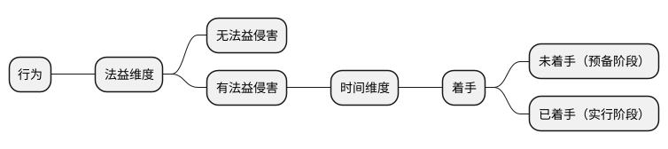
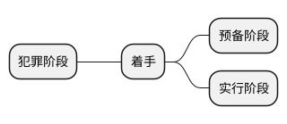
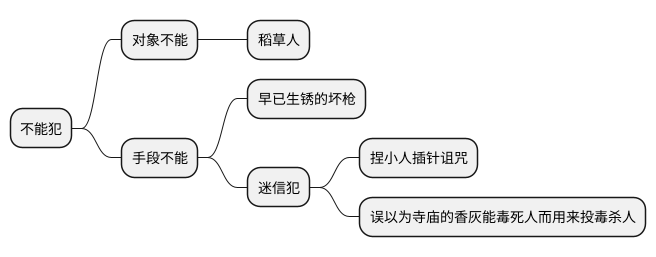

[UP](/law/criminal-law-index.html)


```text
犯罪形态，是针对『故意犯罪』而言的，『过失犯罪』没有犯罪形态的问题。
```


## 行为

### 两个维度：法益 + 时间



<table>
    <thead>
    <tr>
        <th style="text-align: center;" rowspan="3">无法益侵害</th>
        <th style="text-align: center;" colspan="5">有法益侵害</th>
    </tr>
    <tr>
        <th style="text-align: center;" colspan="2">预备阶段</th>
        <th style="text-align: center;" colspan="3">实行阶段</th>
    </tr>
    <tr>
        <th style="text-align: center;">中止</th>
        <th style="text-align: center;">预备</th>
        <th style="text-align: center;">中止</th>
        <th style="text-align: center;">未遂</th>
        <th style="text-align: center;">既遂</th>
    </tr>
    </thead>
    <tbody>
    <tr>
        <td>不能犯</td>
        <td></td>
        <td></td>
        <td></td>
        <td>未遂犯</td>
        <td></td>
    </tr>
    </tbody>
</table>

## 行为 - 着手：行为的时间维度




### 标准

### 作用

着手的两个作用：

- 区分『犯罪预备』和『犯罪未遂』
- 区分『预备阶段的犯罪中止』和『实行阶段的犯罪中止』

### 示例

入室盗窃，小孩盗窃成功，回来的路上被拐卖了，盗窃罪间接正犯的犯罪既遂

```text
判断『着手』是判断『行为』对法益的危险有没有达到紧迫程度；
判断『不能犯』和『未遂犯』是判断『行为』对法益有没有危险？

核心问题就是：『行为』对『法益』有没有危险，以及危险达到什么程度的问题。
```

## 行为 - 危害性：行为的法益维度


## 犯罪预备

```text
考点：核心点是判断『预备行为』
```

```text
密谋策划，是预备行为，对法益多多少少有一定的危险性。
```

## 犯罪未遂


## 不能犯与未遂犯



## 犯罪中止

### 成立条件

```text
能达目的而不欲，是中止；
欲达目的而不能，是未遂。
```

<table>
    <thead>
    <tr>
        <th style="text-align: center;">前提条件</th>
        <th style="text-align: center;">主观条件</th>
    </tr>
    </thead>
    <tbody>
    <tr>
        <td>能不能犯罪</td>
        <td>想不想犯罪</td>
    </tr>
    </tbody>
</table>

- 前提条件
    - 客观说
        - 社会一般人标准
            - 客观
            - 伦理

未遂和中止的区分：

```text
正常情况，看客观；
认识错误，看主观；
```

```text
自己的自信，
不要建立在别人的认可上。
如果你的自信建立在别人的认可上的话，
你的这个自信就像风中的蜡烛，
是飘忽不定的，是没有根基的。

真正的自信，
是能够承受别人的否定，
别人可能会说你狗屁不通，
但是你能做到心里有数，
对别人的否定评价是不在意的，
这就是真正的自信。
```

## 犯罪既遂


```text
人生就是一团欲望，
当欲望得不到满足的时候，
你肯定是痛苦的；
但是，欲望得到满足之后，
我们很快也就陷入无聊状态了。
我们人生的精神状态，
就是在这个痛苦和无聊之间不断的摇摆。
```

```text
此前种种就当昨日死，
此后种种就从今日生。
曾国藩
```


```text
犯意消除，不好判断；
难就难在这里，的确不好判断；
做题的时候，如果是一个客观标准，那很好办；
但是，一遇到主观心理活动，就的确难。
犯意消除，就是一个主观心理活动。
这时候，只能根据给定的题干信息，去推定，去推导。

每一个决定转身的人，
他都在风里站了很久。
```


## 各个犯罪形态的联系

### 终局形态

```text
终局形态 = 行为结束 + 犯意消除
```


### 犯罪形态的相互排斥

<table>
    <caption>行为模型 - 『未遂』排斥『中止』</caption>
    <thead>
    <tr>
        <th style="text-align: center;">案件</th>
        <th style="text-align: center;">第一个时间节点</th>
        <th style="text-align: center;">第二个时间节点</th>
        <th style="text-align: center;">分析</th>
    </tr>
    </thead>
    <tbody>
    <tr>
        <td>捅 10 刀（行为结束，犯意消除）</td>
        <td>甲欲杀乙，猛砍 10 刀，乙身受重伤，甲以为乙很快必死无疑，扔掉到刀便离开现场。</td>
        <td>2 个小时后，甲回到现场，发现乙还没有死，又可怜乙，将其送到医院救活。</td>
        <td>第一时间阶段，犯罪行为彻底消除，犯意消除，犯罪呈现终局形态。甲犯罪未遂。</td>
    </tr>
    <tr>
        <td>煤气（犯意没有消除）</td>
        <td>丈夫睡觉，妻子打开煤气，出门在院子等待</td>
        <td>半小时后，妻子回屋，发现丈夫未死，顿生悔意，将丈夫救活。</td>
        <td>第一时间阶段，犯意未消除，犯罪没又呈现终局形态。妻子犯罪中止。</td>
    </tr>
    </tbody>
</table>

### 犯罪未遂与犯罪中止


### 处罚


## 大总结

```text
犯罪形态，其实是研究一个问题，一条主线，
就是犯罪行为随着时间的发展，对法益的侵害越来越严重。
预备行为，对法益侵害，只是遥远的、轻缓的危险；（抽象的危险）
一旦着手实行，它对法益侵害，制造的危险已经非常紧迫，现实、紧迫、直接的危险；
如果发生了实害结果，那就走到既遂这一步了。
```

```text
考点：犯罪形态的区分，“区分”主要就是行为对法益的侵害程度不同。
把“区分的标准”提炼好，把『行为模型』建构好，
```
