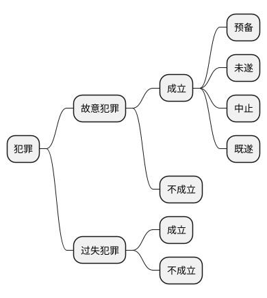
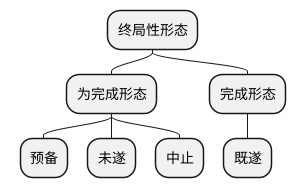
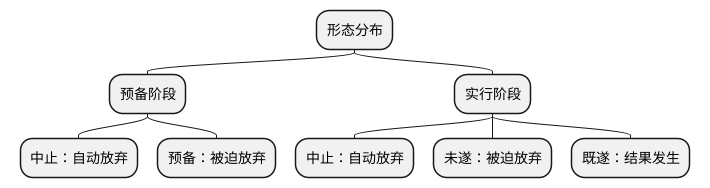

[UP](/law/law-index.html)

```text
犯罪形态，是针对『故意犯罪』而言的，『过失犯罪』没有犯罪形态的问题。
```


```plantuml
@startmindmap

* 犯罪
    * 故意犯罪
        * 成立
            * 预备
            * 未遂
            * 中止
            * 既遂
        * 不成立
    * 过失犯罪
        * 成立
        * 不成立

@endmindmap
```


```plantuml
@startmindmap

top to bottom direction

* 终局性形态
    * 为完成形态
        * 预备
        * 未遂
        * 中止
    * 完成形态
        * 既遂

@endmindmap
```


```plantuml
@startmindmap

top to bottom direction

* 形态分布
    * 预备阶段
        * 中止：自动放弃
        * 预备：被迫放弃
    * 实行阶段
        * 中止：自动放弃
        * 未遂：被迫放弃
        * 既遂：结果发生

@endmindmap
```

## 犯罪预备

```text
考点：核心点是判断『预备行为』
```

```text
密谋策划，是预备行为，对法益多多少少有一定的危险性。
```

## 着手

### 标准

### 作用

着手的两个作用：

- 区分『犯罪预备』和『犯罪未遂』
- 区分『预备阶段的犯罪中止』和『实行阶段的犯罪中止』

### 示例

入室盗窃，小孩盗窃成功，回来的路上被拐卖了，盗窃罪间接正犯的犯罪既遂

```text
判断『着手』是判断『行为』对法益的危险有没有达到紧迫程度；
判断『不能犯』和『未遂犯』是判断『行为』对法益有没有危险？

核心问题就是：『行为』对『法益』有没有危险，以及危险达到什么程度的问题。
```

## 不能犯与未遂犯
