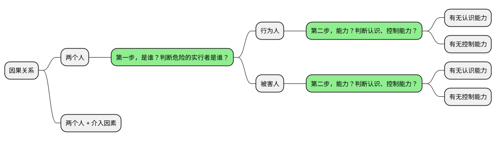

[UP](/law/criminal-law-index.html)

## 知识点

```plantuml
@startmindmap

* 因果关系
    * 两个人
        *[#lightgreen] 第一步，是谁？判断危险的实行者是谁？
            * 行为人
                *[#lightgreen] 第二步，能力？判断认识、控制能力？
                    * 有无认识能力
                    * 有无控制能力
            * 被害人
                *[#lightgreen] 第二步，能力？判断认识、控制能力？
                    * 有无认识能力
                    * 有无控制能力
    * 两个人 + 介入因素

@endmindmap
```

## 应用情景

```plantuml
@startmindmap

* 因果关系

@endmindmap
```
