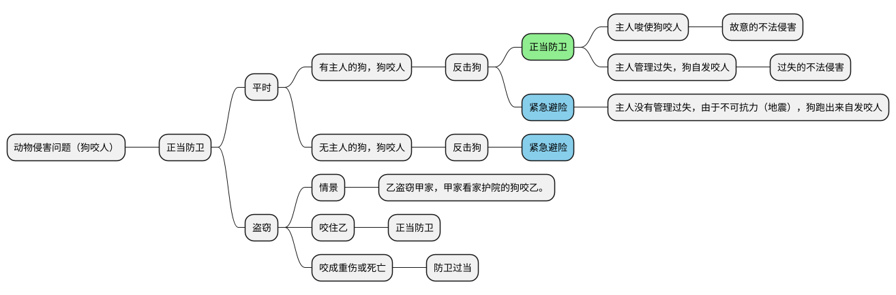

[UP](/law/criminal-law-index.html)


```text
甲 → 狗 → 乙

甲有狗，狗咬乙
```


```plantuml
@startmindmap

* 动物侵害问题（狗咬人）
    * 正当防卫
        * 平时
            * 有主人的狗，狗咬人
                * 反击狗
                    *[#lightgreen] 正当防卫
                        * 主人唆使狗咬人
                            * 故意的不法侵害
                        * 主人管理过失，狗自发咬人
                            * 过失的不法侵害
                    *[#skyblue] 紧急避险
                        * 主人没有管理过失，由于不可抗力（地震），狗跑出来自发咬人
            * 无主人的狗，狗咬人
                * 反击狗
                    *[#skyblue] 紧急避险
        * 盗窃
            * 情景
                * 乙盗窃甲家，甲家看家护院的狗咬乙。
            * 咬住乙
                * 正当防卫
            * 咬成重伤或死亡
                * 防卫过当

@endmindmap
```
