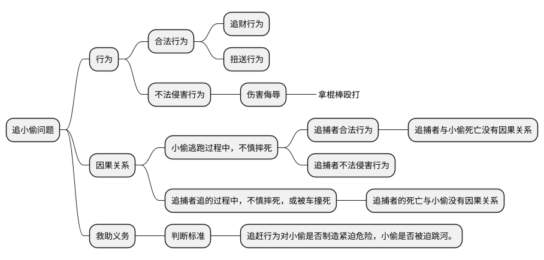

[UP](/law/criminal-law-index.html)

## 追小偷问题

```plantuml
@startmindmap

* 追小偷问题
    * 行为
        * 合法行为
            * 追财行为
            * 扭送行为
        * 不法侵害行为
            * 伤害侮辱
                *_ 拿棍棒殴打
    * 因果关系
        * 小偷逃跑过程中，不慎摔死
            * 追捕者合法行为
                * 追捕者与小偷死亡没有因果关系
            * 追捕者不法侵害行为
        * 追捕者追的过程中，不慎摔死，或被车撞死
            * 追捕者的死亡与小偷没有因果关系
    * 救助义务
        * 判断标准
            * 追赶行为对小偷是否制造紧迫危险，小偷是否被迫跳河。

@endmindmap
```
