[UP](/law/law-index.html)

关键问题：

* 如何认定危害行为？
* 不作为犯的认定问题

## 概览


## 行为分类

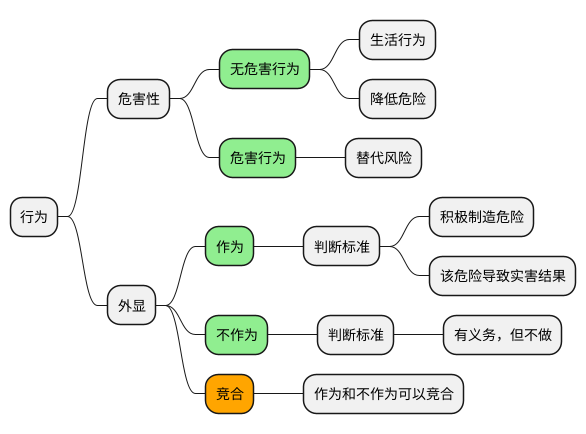

## 危害行为

### 本质

最本质：

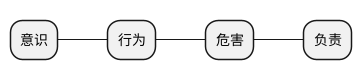

思路：

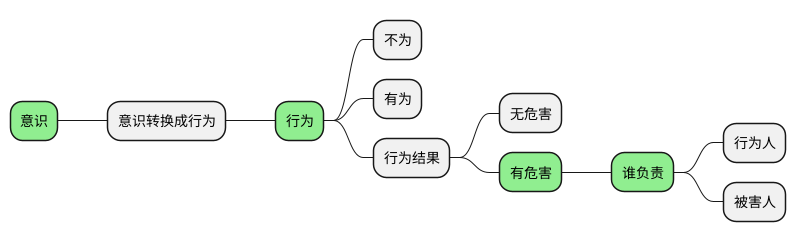

```text
古人云：
万恶淫为首，论迹不论心，论心世上无圣人；（做坏事，看行为-迹）
百善孝为先，论心不论迹，论迹人间无孝子。

思想不构成犯罪（意识）
```

### 特征

危害行为的特征：

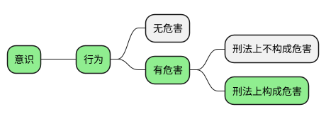

解释：

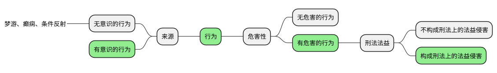

### 辨别

危害行为的辨别:

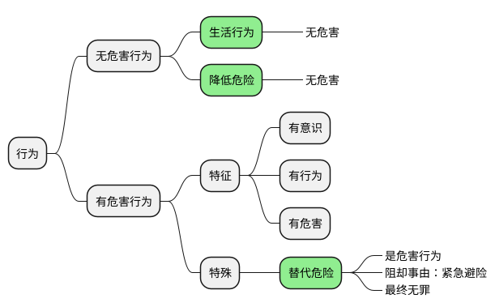

### 谁负责

```text
行有不得，反求诸己。
```

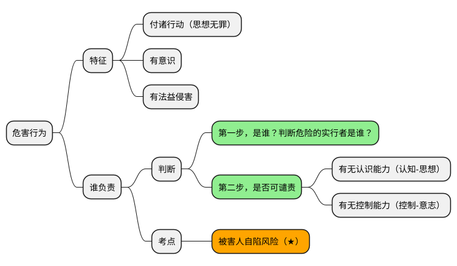

## 不作为

### 不作为犯分类

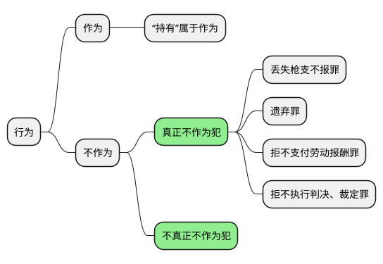

### 不作为犯成立条件

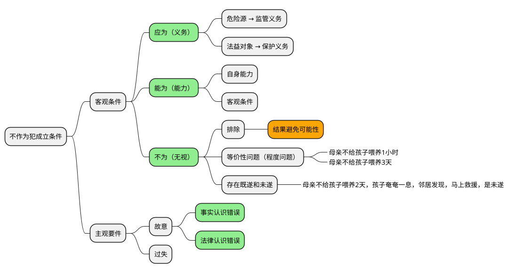

### 作为义务-实质的二分说

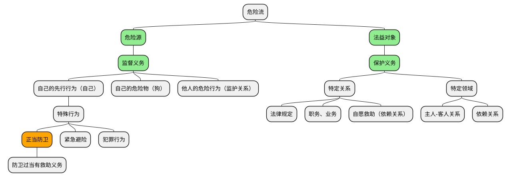

## 总结

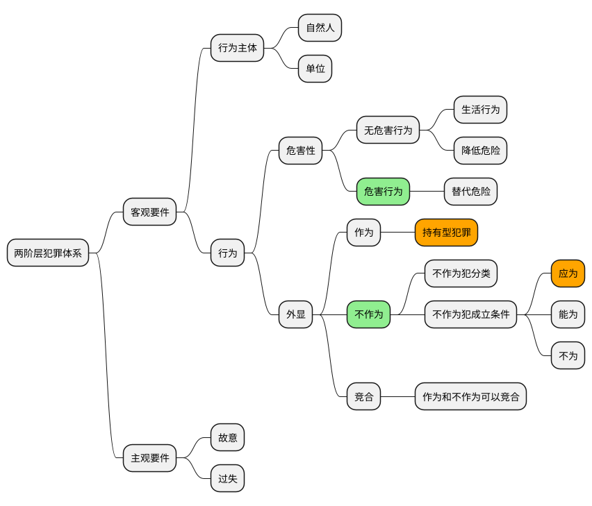
