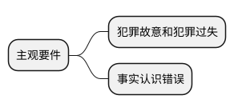
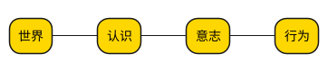
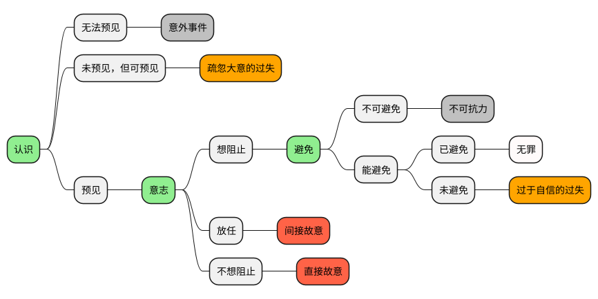
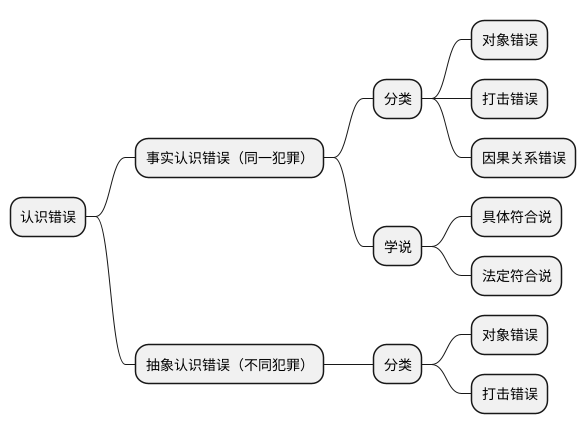
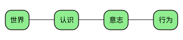
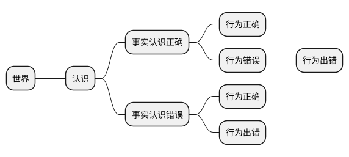
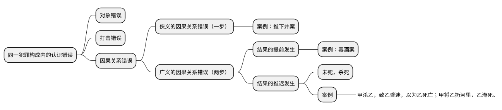

[UP](/law/law-index.html)



```text
认识 → 意志 → 避免
```




## 犯罪故意

### 分类


### 判断标准：主客观相一致原则

```text
犯罪故意的原则，叫主客观相一致原则；

过失犯罪，是没有主客观相一致原则的。
```


## 罪过形式的区分




<table>
    <thead>
    <tr>
        <th style="text-align: center;">罪过形式</th>
        <th style="text-align: center;">认识因素（是否预见）</th>
        <th style="text-align: center;">意志因素（阻止意愿）</th>
        <th style="text-align: center;">行为因素（是否避免）</th>
    </tr>
    </thead>
    <tbody>
    <tr>
        <td>直接故意</td>
        <td>&#x2714;</td>
        <td>&#x2718;</td>
        <td></td>
    </tr>
    <tr>
        <td>间接故意</td>
        <td>&#x2714;</td>
        <td>&#x2718;（放任）</td>
        <td></td>
    </tr>
    <tr>
        <td>过于自信的过失</td>
        <td>&#x2714;</td>
        <td>&#x2714;</td>
        <td>&#x2718;</td>
    </tr>
    <tr>
        <td>疏忽大意的过失</td>
        <td>&#x2718;（有认识可能性）</td>
        <td></td>
        <td></td>
    </tr>
    <tr>
        <td>意外事件</td>
        <td>&#x2718;</td>
        <td></td>
        <td></td>
    </tr>
    <tr>
        <td>不可抗力</td>
        <td>&#x2714;</td>
        <td>&#x2714;</td>
        <td>&#x2718;</td>
    </tr>
    </tbody>
</table>

## 认识错误



## 事实认识错误






### 同一犯罪构成内的认识错误


