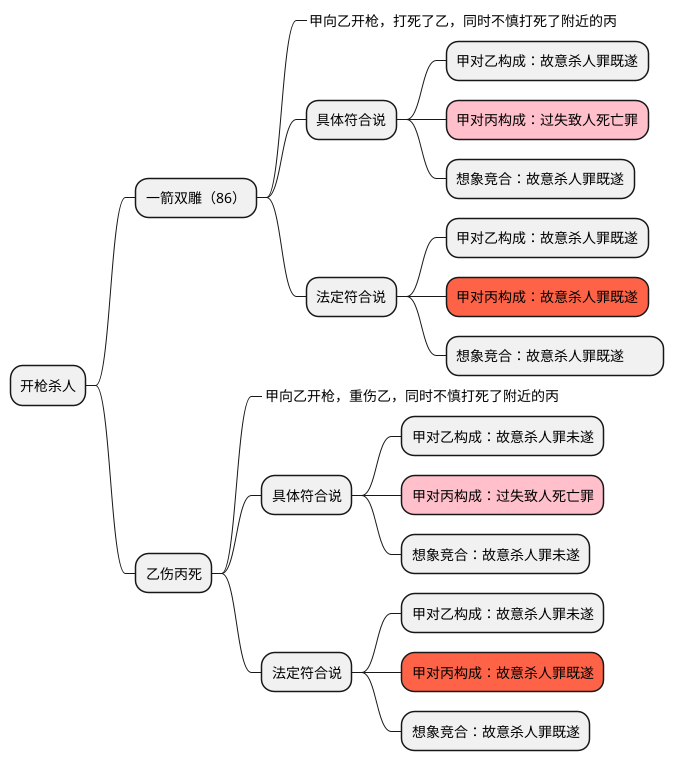

[UP](/law/law-index.html)

```plantuml
@startmindmap

* 开枪杀人
    * 一箭双雕（86）
        *_ 甲向乙开枪，打死了乙，同时不慎打死了附近的丙
        * 具体符合说
            * 甲对乙构成：故意杀人罪既遂
            *[#pink] 甲对丙构成：过失致人死亡罪
            * 想象竞合：故意杀人罪既遂
        * 法定符合说
            * 甲对乙构成：故意杀人罪既遂
            *[#tomato] 甲对丙构成：故意杀人罪既遂
            * 想象竞合：故意杀人罪既遂        
    * 乙伤丙死
        *_ 甲向乙开枪，重伤乙，同时不慎打死了附近的丙
        * 具体符合说
            * 甲对乙构成：故意杀人罪未遂
            *[#pink] 甲对丙构成：过失致人死亡罪
            * 想象竞合：故意杀人罪未遂
        * 法定符合说
            * 甲对乙构成：故意杀人罪未遂
            *[#tomato] 甲对丙构成：故意杀人罪既遂
            * 想象竞合：故意杀人罪既遂

@endmindmap
```