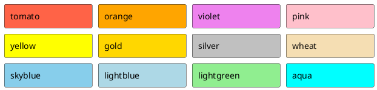

[UP](/plantuml/plantuml-index.html)

## 颜色

### 所有

```text
@startuml
colors
@enduml
```


### palette

```text
@startuml
colors chocolate
@enduml
```


## 挑选




## 参考

- [Colors](https://plantuml.com/color)