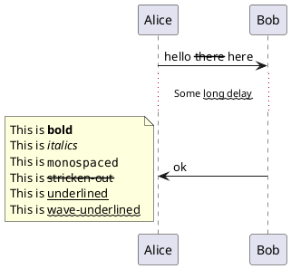
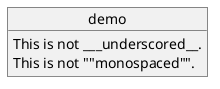
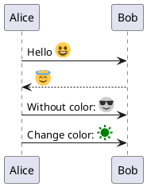
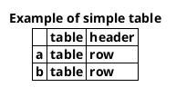
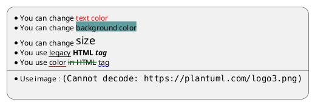

[UP](/plantuml/plantuml-index.html)

```text
creole:
a language that has developed from a mixture of languages
（多种语言混合形成的）混合语
```

## Emphasized text

```text
@startuml
Alice -> Bob : hello --there-- here
... Some ~~long delay~~ ...
Bob -> Alice : ok
note left
  This is **bold**
  This is //italics//
  This is ""monospaced""
  This is --stricken-out--
  This is __underlined__
  This is ~~wave-underlined~~
end note
@enduml
```



## Escape character

You can use the tilde `~` to escape special creole characters.

```text
@startuml
object demo {
  This is not ~___underscored__.
  This is not ~""monospaced"".
}
@enduml
```



## Emoji

- [emoji-cheat-sheet](https://github.com/ikatyang/emoji-cheat-sheet/blob/master/README.md)

```text
@startuml
Alice -> Bob : Hello <:1f600:>
return <:innocent:>
Alice -> Bob : Without color: <#0:sunglasses:>
Alice -> Bob : Change color: <#green:sunny:>
@enduml
```



## Table



## Legacy UML

- `<b>` for bold text
- `<u>` or `<u:#AAAAAA>` or `<u:[[color|colorName]]>` for underline
- `<i>` for italic
- `<s>` or `<s:#AAAAAA>` or `<s:[[color|colorName]]>` for strike text
- `<w>` or `<w:#AAAAAA>` or `<w:[[color|colorName]]>` for wave underline text
- `<plain>` for plain text
- `<color:#AAAAAA>` or `<color:[[color|colorName]]>`
- `<back:#AAAAAA>` or `<back:[[color|colorName]]>` for background color
- `<size:nn>` to change font size
- ` :` the file must be accessible by the filesystem
- ` :` the URL must be available from the Internet
- `{scale:nn}` to change image size, eg ``



## OpenIconic

OpenIconic is a very nice open-source icon set.
Those icons are integrated in the creole parser, so you can use them out-of-the-box.

Use the following syntax: `<&ICON_NAME>`.

## 参考

- [Creole](https://plantuml.com/creole)
