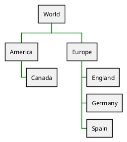

[UP](/plantuml/plantuml-index.html)


## Properties

The following properties can be set in style:

- `FontName`
- `FontColor`
- `FontSize`
- `FontStyle`
- `BackGroundColor`
- `HyperLinkColor`
- `LineColor` (old `BorderColor`) : seems more generic
- `LineThickness`
- `LineStyle` (old `BorderStyle`): on real number or two real numbers separated with -
- `Padding`
- `Margin`
- `RoundCorner`
- `DiagonalCorner`
- `ExportedName` : used for some format (SVG), not implemented
- `Image` : not implemented
- `ImagePosition` : not implemented
- `MinimumWidth` : not implemented
- `WordWrap` (to be renamed as `MaximumWidth`) (add carriage return if needed)
- `HorizontalAlignment` : `left`, `right` or `center`
- ...

## Current Working Model

Style can be inlined using `<style>` and `</style>` separators.

It is also possible to store style definition in some external file and
to reference it using `<style file=MyOwnFile.css>`.

## Basic styling for elements

### 示例：sequence

```text
@startuml
' style enclosure declaration
<style>

    ' scope to sequenceDiagram elements
    sequenceDiagram {

        ' scope to actor element types
        actor {
          FontColor Blue
        }

    }
}
</style>

' printed in blue
actor Bob
' also printed in blue
actor Sally
@enduml
```



```plantuml
@startuml
' style enclosure declaration
<style>

    ' scope to sequenceDiagram elements
    sequenceDiagram {

        ' scope to actor element types
        actor {
          FontColor Blue
        }

    }
}
</style>

' printed in blue
actor Bob
' also printed in blue
actor Sally
@enduml
```

### 示例：WBS

```text
@startwbs
<style>
' this time, scoping to wbsDiagram
wbsDiagram {

    ' Here we introduce a global style, i.e. not targeted to any element
    ' thus all lines (meaning connector and borders,
    ' there are no other lines in WBS) are black by default
    Linecolor black

    ' But we can also target a diagram specific element, like arrow
     arrow {
        ' note that Connectors are actually "Arrows"; this may change in the future
        ' so this means all Connectors and Arrows are now going to be green
        LineColor green
    }

}
</style>

* World
** America
*** Canada
** Europe
*** England
*** Germany
*** Spain
@endwbs
```



## user defined style

We can extend these examples to start targeting not just **element types**,
but **specific elements**.

### 示例：Sequence

With shown stereotype

```text
@startuml
' style enclosure declaration
<style>
    ' scope to sequenceDiagram elements
    sequenceDiagram {

        ' scope to actor element types
        actor {
          FontColor Blue
        }

        ' define a new style, using CSS class syntax
        .myStyle {
           FontColor Red
        }

    }
</style>

' printed in blue
actor Bob
' this will now be printed in Red
actor Sally <<myStyle>>
@enduml
```



```plantuml
@startuml
' style enclosure declaration
<style>
    ' scope to sequenceDiagram elements
    sequenceDiagram {

        ' scope to actor element types
        actor {
          FontColor Blue
        }

        ' define a new style, using CSS class syntax
        .myStyle {
           FontColor Red
        }

    }
</style>

' printed in blue
actor Bob
' this will now be printed in Red
actor Sally <<myStyle>>
@enduml
```

With not shown stereotype: `hide stereotype`

```text
@startuml
hide stereotype
' style enclosure declaration
<style>
    ' scope to sequenceDiagram elements
    sequenceDiagram {

        ' scope to actor element types
        actor {
          FontColor Blue
        }

        ' define a new style, using CSS class syntax
        .myStyle {
           FontColor Red
        }

    }
</style>

' printed in blue
actor Bob
' this will now be printed in Red
actor Sally <<myStyle>>
@enduml
```



```plantuml
@startuml
hide stereotype
' style enclosure declaration
<style>
    ' scope to sequenceDiagram elements
    sequenceDiagram {

        ' scope to actor element types
        actor {
          FontColor Blue
        }

        ' define a new style, using CSS class syntax
        .myStyle {
           FontColor Red
        }

    }
</style>

' printed in blue
actor Bob
' this will now be printed in Red
actor Sally <<myStyle>>
@enduml
```

## Using Dynamic Selectors

```plantuml

```

## Reference

- [Style (or CSS like style)](https://plantuml.com/style-evolution)