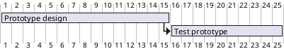

[UP](/plantuml/plantuml-index.html)

## Short names and alias

It is possible to define short name for tasks with the `as` keyword.

```text
@startgantt
[Prototype design] as [D] requires 15 days
[Test prototype] as [T] requires 10 days
[T] starts at [D]'s end
@endgantt
```


