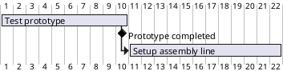
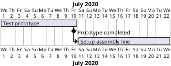
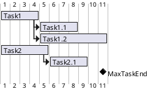

[UP](/plantuml/plantuml-index.html)

You can define Milestones using the `happen` verb.

## Relative milestone (use of constraints)

```text
@startgantt
[Test prototype] requires 10 days
[Prototype completed] happens at [Test prototype]'s end
[Setup assembly line] requires 12 days
[Setup assembly line] starts at [Test prototype]'s end
@endgantt
```



## Absolute milestone (use of fixed date)

```text
@startgantt
Project starts 2020-07-01
[Test prototype] requires 10 days
[Prototype completed] happens 2020-07-10
[Setup assembly line] requires 12 days
[Setup assembly line] starts at [Test prototype]'s end
@endgantt
```



## Milestone of maximum end of tasks

```text
@startgantt
[Task1] requires 4 days
then [Task1.1] requires 4 days
[Task1.2] starts at [Task1]'s end and requires 7 days

[Task2] requires 5 days
then [Task2.1] requires 4 days

[MaxTaskEnd] happens at [Task1.1]'s end
[MaxTaskEnd] happens at [Task1.2]'s end
[MaxTaskEnd] happens at [Task2.1]'s end

@endgantt
```

