```plantuml
@startgantt
[Prototype design] requires 13 days
[Test prototype] requires 4 days and 1 week
[Test prototype] starts 1 week and 2 days after [Prototype design]'s end
[Test prototype] displays on same row as [Prototype design]

[r1] happens on 5 days after [Prototype design]'s end
[r2] happens on 5 days after [r1]'s end
[r3] happens on 5 days after [r2]'s end
[r2] displays on same row as [r1]
[r3] displays on same row as [r1]
@endgantt
```

[UP](/plantuml/plantuml-index.html)

You can put Tasks or Milestones on the same line, with this syntax:

```text
[T|M] displays on same row as [T|M]
```

```text
@startgantt
[Prototype design] requires 13 days
[Test prototype] requires 4 days and 1 week
[Test prototype] starts 1 week and 2 days after [Prototype design]'s end
[Test prototype] displays on same row as [Prototype design]

[r1] happens on 5 days after [Prototype design]'s end
[r2] happens on 5 days after [r1]'s end
[r3] happens on 5 days after [r2]'s end
[r2] displays on same row as [r1]
[r3] displays on same row as [r1]
@endgantt
```


