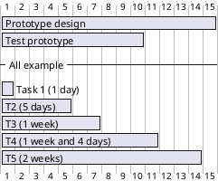
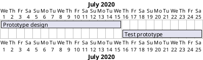
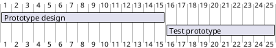
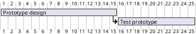
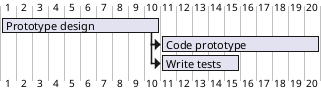

[UP](/plantuml/plantuml-index.html)

## Declaring tasks

### Workload

The workload for each task is specified using the `requires` verb,
indicating the amount of work needed in terms of `days`.

```text
@startgantt
[Prototype design] requires 15 days
[Test prototype] requires 10 days
-- All example --
[Task 1 (1 day)] requires 1 day
[T2 (5 days)] requires 5 days
[T3 (1 week)] requires 1 week
[T4 (1 week and 4 days)] requires 1 week and 4 days
[T5 (2 weeks)] requires 2 weeks
@endgantt
```



### Start

Their beginning are defined using the `start` verb:

```text
@startgantt
[Prototype design] requires 15 days
[Test prototype] requires 10 days

Project starts 2020-07-01
[Prototype design] starts 2020-07-01
[Test prototype] starts 2020-07-16
@endgantt
```



```text
@startgantt
[Prototype design] requires 15 days
[Test prototype] requires  10 days

[Prototype design] starts D+0
[Test prototype] starts D+15
@endgantt
```



### End

Their ending are defined using the `end` verb:

```text
@startgantt
[Prototype design] requires 15 days
[Test prototype] requires 10 days

Project starts 2020-07-01
[Prototype design] ends 2020-07-15
[Test prototype] ends 2020-07-25
@endgantt
```


```text
@startgantt
[Prototype design] requires 15 days
[Test prototype] requires 10 days

[Prototype design] ends D+14
[Test prototype] ends D+24
@endgantt
```


### Start/End

It is possible to define both absolutely, by specifying dates:

```text
@startgantt
Project starts 2020-07-01
[Prototype design] starts 2020-07-01
[Test prototype] starts 2020-07-16
[Prototype design] ends 2020-07-15
[Test prototype] ends 2020-07-25
@endgantt
```


```text
@startgantt
[Prototype design] starts D+0
[Test prototype] starts D+15
[Prototype design] ends D+14
[Test prototype] ends D+24
@endgantt
```


```text
@startgantt
Project starts 2020-07-01
[Prototype design] starts 2020-07-01 and ends 2020-07-15
[Test prototype] starts 2020-07-16 and requires 10 days
@endgantt
```

### One-line declaration


## Adding constraints

It is possible to add constraints between tasks.

```text
@startgantt
[Prototype design] requires 15 days
[Test prototype] requires 10 days
[Test prototype] starts at [Prototype design]'s end
@endgantt
```



```text
@startgantt
[Prototype design] requires 10 days
[Code prototype] requires 10 days
[Write tests] requires 5 days
[Code prototype] starts at [Prototype design]'s end
[Write tests] starts at [Code prototype]'s start
@endgantt
```


