[UP](/plantuml/plantuml-index.html)

## Customize colors

It is also possible to customize colors with `is colored in`.

```text
@startgantt
[Prototype design] requires 13 days
[Prototype design] is colored in Fuchsia/FireBrick
[Test prototype] requires 4 days
[Test prototype] starts at [Prototype design]'s end
[Test prototype] is colored in GreenYellow/Green
@endgantt
```

```plantuml
@startgantt
[Prototype design] requires 13 days
[Prototype design] is colored in Fuchsia/FireBrick
[Test prototype] requires 4 days
[Test prototype] starts at [Prototype design]'s end
[Test prototype] is colored in GreenYellow/Green
@endgantt
```


