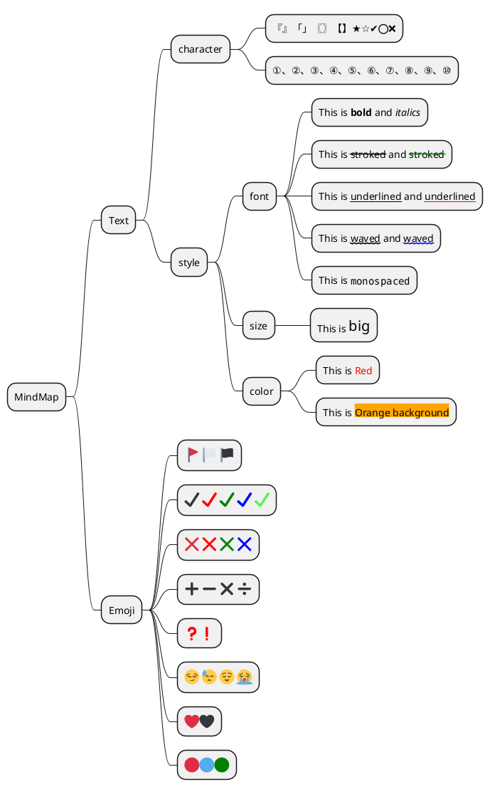

[UP](/plantuml/plantuml-index.html)

```text
@startmindmap

* MindMap
    * Text
        * character
            * 『』「」〖〗【】★☆✔️⭕❌
            * ①、②、③、④、⑤、⑥、⑦、⑧、⑨、⑩
        * style
            * font
                * This is <b>bold</b> and <i>italics</i>
                * This is <s>stroked</s> and <s:green>stroked</s>
                * This is <u>underlined</u> and <u:red>underlined</u>
                * This is <w>waved</w> and <w:#0000FF>waved</w>
                * This is <font:monospaced>monospaced</font>
            * size
                * This is <size:20>big</size>
            * color
                * This is <color:red>Red</color>
                * This is <back:orange>Orange background</back>
    * Emoji
        * <:triangular_flag_on_post:> <:white_flag:> <:black_flag:>
        * <:heavy_check_mark:> <#red:heavy_check_mark:> <#green:heavy_check_mark:> <#blue:heavy_check_mark:> <#60EE60:heavy_check_mark:>
        * <:x:> <#red:x:> <#green:x:> <#blue:x:>
        * <:heavy_plus_sign:> <:heavy_minus_sign:> <:heavy_multiplication_x:> <:heavy_division_sign:>
        * <#red:question:><#red:exclamation:>
        * <:smirk:> <:sweat:> <:relieved:> <:sob:>
        * <:heart:><:black_heart:>
        * <:red_circle:><:large_blue_circle:><#green:red_circle:>

@endmindmap
```


