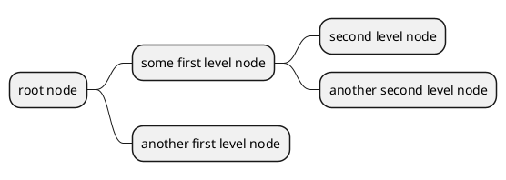
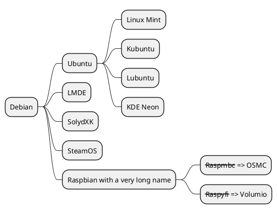
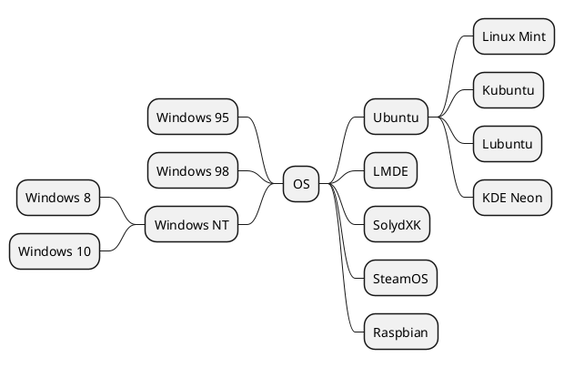

[UP](/plantuml/plantuml-index.html)

## Markdown syntax

```text
@startmindmap
* root node
	* some first level node
		* second level node
		* another second level node
	* another first level node
@endmindmap
```



## OrgMode syntax



## Arithmetic notation

```text
@startmindmap
+ OS
++ Ubuntu
+++ Linux Mint
+++ Kubuntu
+++ Lubuntu
+++ KDE Neon
++ LMDE
++ SolydXK
++ SteamOS
++ Raspbian
-- Windows 95
-- Windows 98
-- Windows NT
--- Windows 8
--- Windows 10
@endmindmap
```


