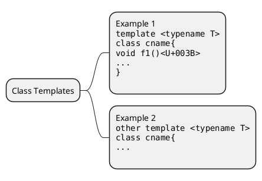
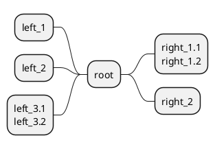

[UP](/plantuml/plantuml-index.html)

You can use `:` and `;` to have multilines box.

```text
@startmindmap
* Class Templates
**:Example 1
<code>
template <typename T>
class cname{
void f1()<U+003B>
...
}
</code>
;
**:Example 2
<code>
other template <typename T>
class cname{
...
</code>
;
@endmindmap
```



```text
@startmindmap
+ root
**:right_1.1
right_1.2;
++ right_2

left side

-- left_1
-- left_2
**:left_3.1
left_3.2;
@endmindmap
```



