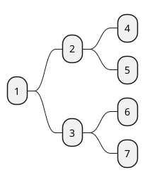
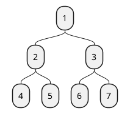
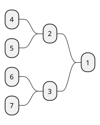
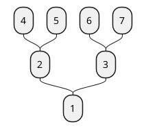

[UP](/plantuml/plantuml-index.html)

You can change (whole) diagram orientation with:
- `left to right direction` (by default)
- `top to bottom direction`
- `right to left direction`
- `bottom to top direction`

## Left to right direction (by default)

```text
@startmindmap
* 1
    * 2
        * 4
        * 5
    * 3
        * 6
        * 7
@endmindmap
```



## Top to bottom direction

```text
@startmindmap
top to bottom direction
* 1
    * 2
        * 4
        * 5
    * 3
        * 6
        * 7
@endmindmap
```



## Right to left direction

```text
@startmindmap
right to left direction
* 1
    * 2
        * 4
        * 5
    * 3
        * 6
        * 7
@endmindmap
```



## Bottom to top direction

```text
@startmindmap
top to bottom direction
left side
* 1
    * 2
        * 4
        * 5
    * 3
        * 6
        * 7
@endmindmap
```


