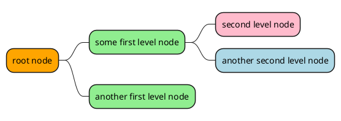
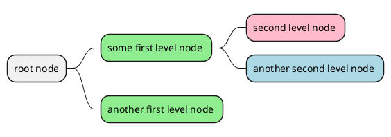
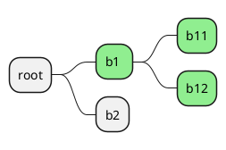

[UP](/plantuml/plantuml-index.html)

## With inline color

```text
@startmindmap
*[#Orange] root node
    *[#lightgreen] some first level node
        *[#FFBBCC] second level node
        *[#lightblue] another second level node
    *[#lightgreen] another first level node
@endmindmap
```



## With style color

### Apply style to a node

```text
@startmindmap
<style>
mindmapDiagram {
    .green {
        BackgroundColor lightgreen
    }
    .rose {
        BackgroundColor #FFBBCC
    }
    .your_style_name {
        BackgroundColor lightblue
    }
}
</style>
* root node
    * some first level node <<green>>
        * second level node <<rose>>
        * another second level node <<your_style_name>>
    * another first level node <<green>>
@endmindmap
```



### Apply style to a branch

```text
@startmindmap
<style>
mindmapDiagram {
    .myStyle * {
        BackgroundColor lightgreen
    }
}
</style>
* root
    * b1 <<myStyle>>
        * b11
        * b12
    * b2
@endmindmap
```



