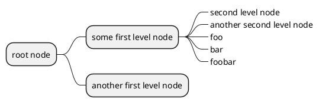

[UP](/plantuml/plantuml-index.html)

You can remove the box drawing using an underscore.

```text
@startmindmap
* root node
    * some first level node
        *_ second level node
        *_ another second level node
        *_ foo
        *_ bar
        *_ foobar
    * another first level node
@endmindmap
```


