[UP](/plantuml/plantuml-index.html)

| Type        | Symbol | Drawing                                            |
|-------------|--------|----------------------------------------------------|
| Extension   | `<--`  |  |
| Composition | `*--`  |      |
| Aggregation | `o--`  |      |

## 基础

### 线形

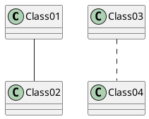

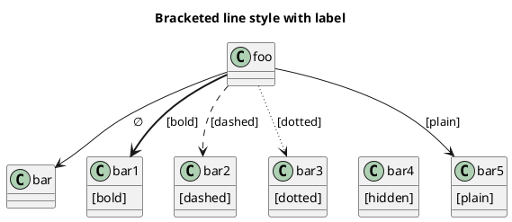

### 箭头

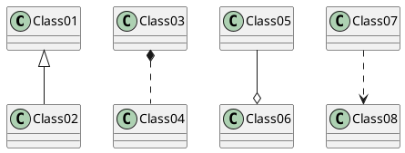

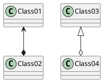

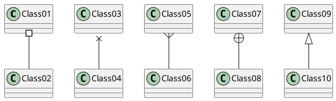

### 颜色

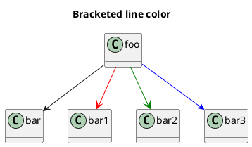

### 线宽

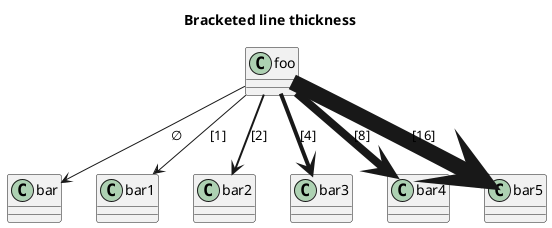

## Label on relations

It is possible to add a label on the relation, using `:`, followed by the text of the label.

### 数量关系

For cardinality, you can use double-quotes `""` on each side of the relation.

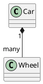

### 文字

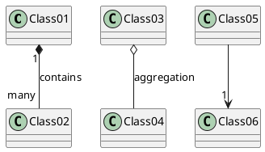

### 行为发起者

You can add an extra arrow pointing at one object showing
which object acts on the other object, using `<` or `>` at the beginning or at the end of the label.

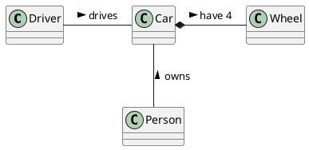

## Extends and implements

It is also possible to use `extends` and `implements` keywords.

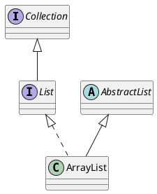

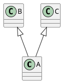

## Arrows from/to class members

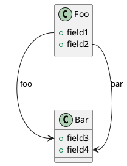

