[UP](/plantuml/plantuml-index.html)


<table>
<thead>
<tr>
    <th>Type</th>
    <th>Symbol</th>
    <th>Purpose</th>
</tr>
</thead>
<tbody>
<tr>
    <td>Extension</td>
    <td><code>&lt;|--</code></td>
    <td>Specialization of a class in a hierarchy</td>
</tr>
<tr>
    <td>Implementation</td>
    <td><code>&lt;|..</code></td>
    <td>Realization of an interface by a class</td>
</tr>
<tr>
    <td>Composition</td>
    <td><code>*--</code></td>
    <td>The part cannot exist without the whole</td>
</tr>
<tr>
    <td>Aggregation</td>
    <td><code>o--</code></td>
    <td>The part can exist independently of the whole</td>
</tr>
<tr>
    <td>Dependency</td>
    <td><code>--&gt;</code></td>
    <td>The object uses another object</td>
</tr>
<tr>
    <td>Dependency</td>
    <td><code>..&gt;</code></td>
    <td>A weaker form of dependency</td>
</tr>
</tbody>
</table>

**1️⃣ 关联（Association）**

- **定义**：表示类之间存在某种“使用”或“联系”关系，通常对应代码中的属性或**成员变量**。
- **特点**：
    - 可以是单向或双向。
    - 可以标注多重性（multiplicity），如 `1..*` 表示一对多。
    - 可以命名关联角色（role）。
- **例子**：`学生`类与`课程`类，学生选修课程。

---

**2️⃣ 聚合（Aggregation）**

- **定义**：一种特殊的关联关系，表示“整体-部分”关系，但部分可以独立存在。
- **符号**：空心菱形（在整体端）。
- **特点**：
    - 表示弱拥有关系。
    - 部分可以属于多个整体或独立存在。
- **例子**：`图书馆`类与`图书`类，图书可以存在于多个图书馆中，也可以独立存在。

---

**3️⃣ 组合（Composition）**

- **定义**：另一种特殊的关联关系，表示强烈的“整体-部分”关系，部分不能脱离整体而存在。
- **符号**：实心菱形（在整体端）。
- **特点**：
    - 表示强拥有关系。
    - 整体消亡，部分也会随之消亡。
- **例子**：`房子`类与`房间`类，房间不能独立于房子存在。

---

**4️⃣ 继承（Generalization / Inheritance）**

- **定义**：表示类之间的“父类-子类”关系。
- **符号**：空心三角箭头指向父类。
- **特点**：
    - 子类继承父类的属性和方法。
    - 支持多态。
- **例子**：`动物`类是`猫`类和`狗`类的父类。

---

**5️⃣ 实现（Realization / Interface Implementation）**

- **定义**：类实现接口的关系。
- **符号**：虚线带空心三角箭头指向接口。
- **特点**：
    - 接口只定义行为，类提供具体实现。
- **例子**：`可飞`接口被`鸟`类实现。

---

**6️⃣ 依赖（Dependency）**

- **定义**：一种使用关系，表示一个类依赖另一个类，通常是**方法参数**、**局部变量**或**返回类型**。
- **符号**：虚线箭头指向被依赖的类。
- **特点**：
    - 弱耦合关系。
    - 短期、临时关系。
- **例子**：`订单处理`类的方法中使用了`客户`类。

---


```text
@startuml
class Number {}

class Integer extends Number {}
@enduml
```


## 基础

### 线形

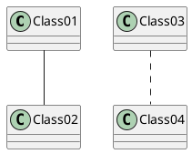
```plantuml
@startuml
Class01 -- Class02
Class03 .. Class04
@enduml
```


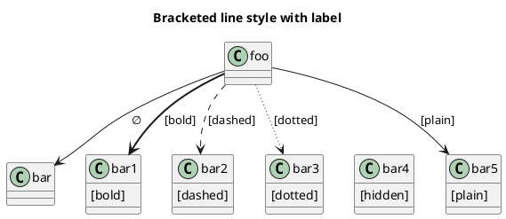
```plantuml
@startuml
title Bracketed line style with label
class foo
class bar

bar1 : [bold]  
bar2 : [dashed]
bar3 : [dotted]
bar4 : [hidden]
bar5 : [plain] 

foo --> bar          : ∅
foo -[bold]-> bar1   : [bold]
foo -[dashed]-> bar2 : [dashed]
foo -[dotted]-> bar3 : [dotted]
foo -[hidden]-> bar4 : [hidden]
foo -[plain]-> bar5  : [plain]

@enduml
```


### 箭头


```plantuml
@startuml
Class01 .. Class02
Class03 -- Class04
@enduml
```


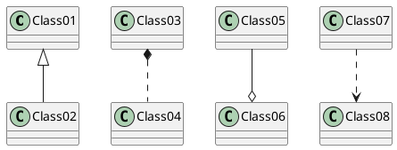
```plantuml
@startuml
Class01 <|-- Class02
Class03 *.. Class04
Class05 --o Class06
Class07 ..> Class08
@enduml
```


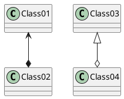
```plantuml
@startuml
Class01 <--* Class02
Class03 <|--o Class04
@enduml
```


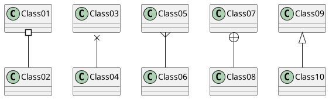
```plantuml
@startuml
Class01 #-- Class02
Class03 x-- Class04
Class05 }-- Class06
Class07 +-- Class08
Class09 ^-- Class10
@enduml
```


### 颜色

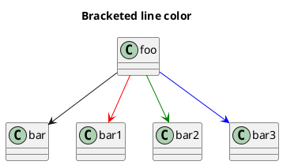
```plantuml
@startuml
title Bracketed line color
class foo
class bar

foo --> bar
foo -[#red]-> bar1
foo -[#green]-> bar2
foo -[#blue]-> bar3
@enduml
```


### 线宽

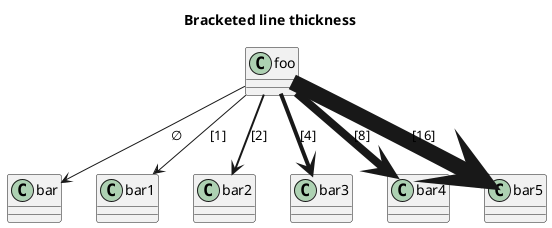
```plantuml
@startuml
title Bracketed line thickness
class foo
class bar

foo --> bar                 : ∅
foo -[thickness=1]-> bar1   : [1]
foo -[thickness=2]-> bar2   : [2]
foo -[thickness=4]-> bar3   : [4]
foo -[thickness=8]-> bar4   : [8]
foo -[thickness=16]-> bar5  : [16]

@enduml
```


## Label on relations

It is possible to add a label on the relation, using `:`, followed by the text of the label.

### 数量关系

For cardinality, you can use double-quotes `""` on each side of the relation.

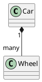
```plantuml
@startuml

Car "1" *-- "many" Wheel

@enduml
```


### 文字

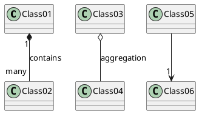
```plantuml
@startuml
Class01 "1" *-- "many" Class02 : contains
Class03 o-- Class04 : aggregation
Class05 --> "1" Class06
@enduml
```


### 行为发起者

You can add an extra arrow pointing at one object showing
which object acts on the other object, using `<` or `>` at the beginning or at the end of the label.

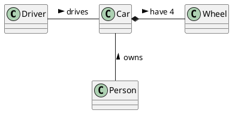
```plantuml
@startuml
Driver - Car : drives >
Car *- Wheel : have 4 >
Car -- Person : < owns
@enduml
```


## Extends and implements

It is also possible to use `extends` and `implements` keywords.

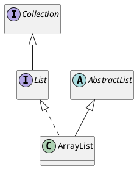
```plantuml
@startuml
interface Collection
interface List extends Collection

abstract class AbstractList
class ArrayList extends AbstractList implements List
@enduml
```


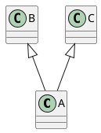
```plantuml
@startuml
class A extends B, C {
}
@enduml
```


## Arrows from/to class members

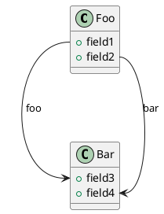
```plantuml
@startuml
class Foo {
+ field1
+ field2
}

class Bar {
+ field3
+ field4
}

Foo::field1 --> Bar::field3 : foo
Foo::field2 --> Bar::field4 : bar
@enduml
```


