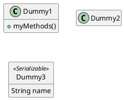

[UP](/plantuml/plantuml-index.html)

## Hide attributes, methods...

You can parameterize the display of classes using the `hide/show` command.

The basic command is: `hide empty members`. This command will hide attributes or methods if they are empty.

Instead of empty members, you can use:

- `empty fields` or `empty attributes` for empty fields,
- `empty methods` for empty methods,
- `fields` or `attributes` which will hide fields, even if they are described,
- `methods` which will hide methods, even if they are described,
- `members` which will hide fields and methods, even if they are described,
- `circle` for the circled character in front of class name,
- `stereotype` for the stereotype.

You can also provide, just after the `hide` or `show` keyword:

- `class` for all classes,
- `interface` for all interfaces,
- `enum` for all enums,
- `<<foo1>>` for classes which are stereotyped with `foo1`,
- an existing class name.

You can use several `show/hide` commands to define rules and exceptions.

