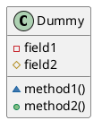
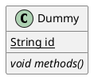

[UP](/plantuml/plantuml-index.html)

## 可见性

| Character | Icon for field                                                 | Icon for method                                                 | Visibility        |
|-----------|----------------------------------------------------------------|-----------------------------------------------------------------|-------------------|
| `-`       |          |          | `private`         |
| `#`       |        |        | `protected`       |
| `~`       |  |  | `package private` |
| `+`       |           |           | `public`          |

- `public` 修饰符表示该成员对所有其他类都是可见的，没有任何访问限制。**圆形**通常用来表示开放性、无障碍和全局可访问的性质。
- `private` 修饰符表示该成员仅对所在的类可见，外部无法直接访问。**方形**通常给人以“封闭”或“限制”的感觉，符合私有成员的封闭性质。
- `protected` 修饰符表示该成员对其自身类和所有子类（包括同包内的类）可见。**菱形**形状通常会联想到“继承”或“保护”，所以用菱形来表示具有继承特征的受保护访问。
- `package private` 表示该成员仅在同一包内可见。**三角形**的形状可能代表了“局部”的或在一个特定范围内可见的访问权限。

## Abstract and Static

You can define static or abstract methods or fields using the `{static}` or `{abstract}` modifier.

