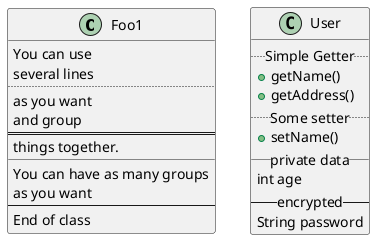

[UP](/plantuml/plantuml-index.html)

## Advanced class body

By default, methods and fields are automatically regrouped by PlantUML.

You can use separators to define your own way of ordering fields and methods.
The following separators are possible:

- `--`
- `..`
- `==`
- `__`

