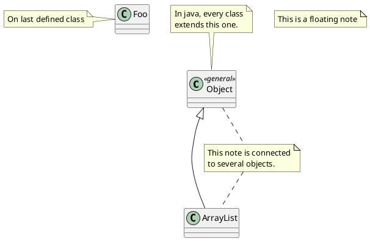
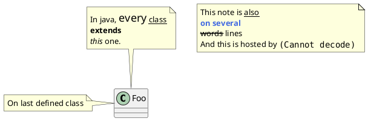
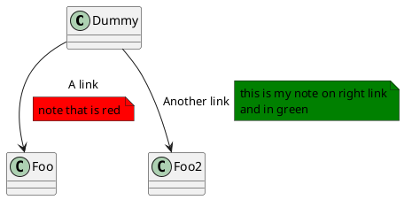

[UP](/plantuml/plantuml-index.html)

## Notes and stereotypes

Stereotypes are defined with the `class` keyword, `<<` and `>>`.

You can also define notes using `note left of`, `note right of`, `note top of`, `note bottom of` keywords.

You can also define a note on the last defined class using `note left`, `note right`, `note top`, `note bottom`.

A note can be also define alone with the `note` keywords, then linked to other objects using the `..` symbol.

## HTML

## Note on links

It is possible to add a note on a link, just after the link definition, using `note on link`.

You can also use `note left on link`, `note right on link`, `note top on link`, `note bottom on link`
if you want to change the relative position of the note with the label.

