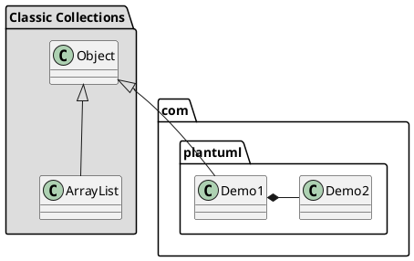
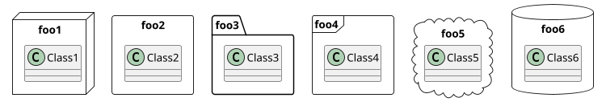
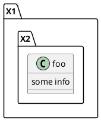
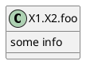
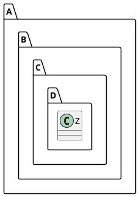
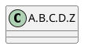
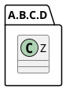

[UP](/plantuml/plantuml-index.html)

## Basic

You can define a package using the `package` keyword,
and optionally declare a background color for your package (Using a html color code or name).

Note that package definitions can be nested.

## Packages style

There are different styles available for packages.

You can specify them either by setting a default style with the command: `skinparam packageStyle`,
or by using a stereotype on the package:

## Automatic package creation

You can define another separator (other than the dot) using the command : `set separator ???`.

You can disable automatic namespace creation using the command `set separator none`.

## 多级包名布局

