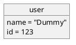
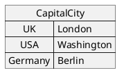
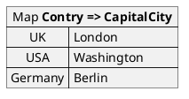
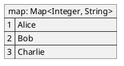
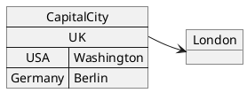
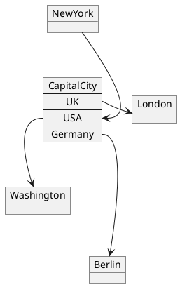
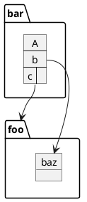
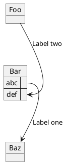

[UP](/plantuml/plantuml-index.html)

## Basic

```plantuml
@startuml

object user
user : name = "Dummy"
user : id = 123
@enduml
```

```plantuml
@startuml

object user {
  name = "Dummy"
  id = 123
}

@enduml
```

## Map table

You can define a map table with `map` keyword and `=>` separator.

```plantuml
@startuml
map CapitalCity {
 UK => London
 USA => Washington
 Germany => Berlin
}
@enduml
```

```plantuml
@startuml
map "Map **Contry => CapitalCity**" as CC {
 UK => London
 USA => Washington
 Germany => Berlin
}
@enduml
```

```plantuml
@startuml
map "map: Map<Integer, String>" as users {
 1 => Alice
 2 => Bob
 3 => Charlie
}
@enduml
```

## Link

```plantuml
@startuml
object London

map CapitalCity {
 UK *-> London
 USA => Washington
 Germany => Berlin
}
@enduml
```

```plantuml
@startuml
object London
object Washington
object Berlin
object NewYork

map CapitalCity {
 UK *-> London
 USA *--> Washington
 Germany *---> Berlin
}

NewYork --> CapitalCity::USA
@enduml
```

```plantuml
@startuml
package foo {
    object baz
}

package bar {
    map A {
        b *-> foo.baz
        c =>
    }
}

A::c --> foo
@enduml
```

```plantuml
@startuml
object Foo
map Bar {
  abc=>
  def=>
}
object Baz

Bar::abc --> Baz : Label one
Foo --> Bar::def : Label two
@enduml
```

