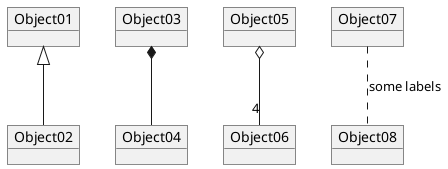
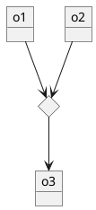

[UP](/plantuml/plantuml-index.html)

```plantuml
@startuml
object Object01
object Object02
object Object03
object Object04
object Object05
object Object06
object Object07
object Object08

Object01 <|-- Object02
Object03 *-- Object04
Object05 o-- "4" Object06
Object07 .. Object08 : some labels
@enduml
```

```plantuml
@startuml
object o1
object o2
diamond dia
object o3

o1  --> dia
o2  --> dia
dia --> o3
@enduml
```

