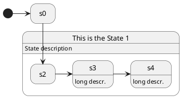

[UP](/plantuml/plantuml-index.html)

You can add description to a state or to a composite state.

```text
@startuml
hide empty description 

state s0

state "This is the State 1" as s1 {
  s1: State description
  state s2
  state s3: long descr.
  state s4
  s4: long descr.
}

[*] -> s0
s0 --> s2

s2 -> s3
s3 -> s4
@enduml
```




