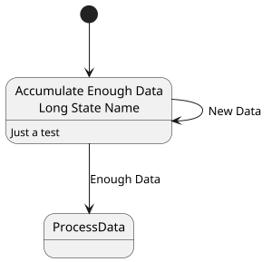

[UP](/plantuml/plantuml-index.html)

You can also use the `state` keyword to use long description for states.

```text
@startuml
scale 300 width

[*] --> myNewName

state "Accumulate Enough Data\nLong State Name" as myNewName
myNewName : Just a test
myNewName --> myNewName : New Data
myNewName --> ProcessData : Enough Data

@enduml
```




