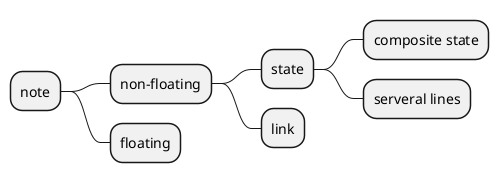
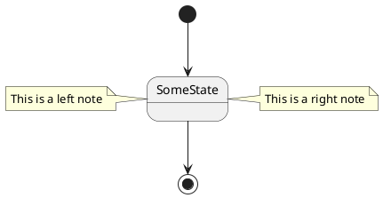
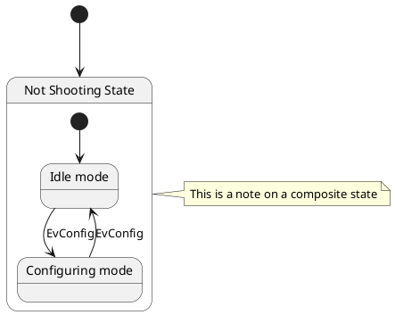
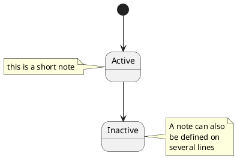
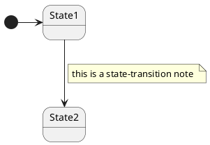
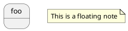

[UP](/plantuml/plantuml-index.html)



define notes using

- `note left of`
- `note right of`
- `note top of`
- `note bottom of` keywords.

## Note on state

```text
@startuml

[*] --> SomeState

SomeState --> [*]

note right of SomeState : This is a right note
note left of SomeState : This is a left note

@enduml
```



### composite state

You can put notes on **composite states**.



### several lines

You can also define notes on several lines.

```text
@startuml

[*] --> Active
Active --> Inactive

note left of Active : this is a short note

note right of Inactive
  A note can also
  be defined on
  several lines
end note

@enduml
```



## Note on link

You can put notes on state-transition or link, with `note on link` keyword.

```text
@startuml
[*] -> State1
State1 --> State2
note on link 
  this is a state-transition note 
end note
@enduml
```



## floating notes

```text
@startuml

state foo
note "This is a floating note" as N1

@enduml
```


