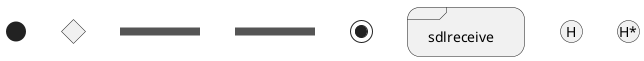
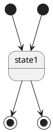
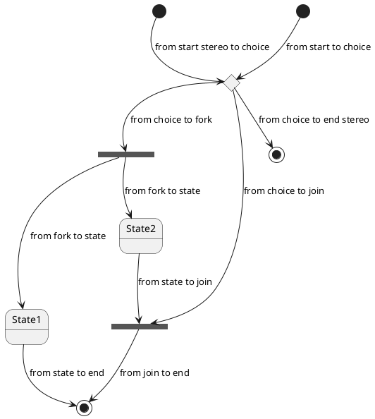
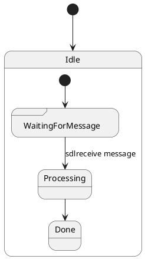
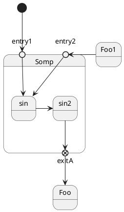
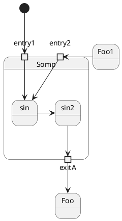
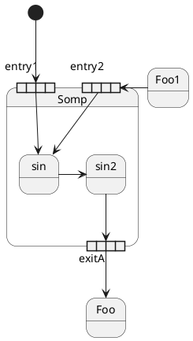

[UP](/plantuml/plantuml-index.html)

## Basic

```text
@startuml
state start1  <<start>>
state choice1 <<choice>>
state fork1   <<fork>>
state join2   <<join>>
state end3    <<end>>
state sdlreceive <<sdlreceive>>
state history <<history>>
state history2 <<history*>>
@enduml
```



### start, end



### Start, choice, fork, join, end

```text
@startuml
state start1  <<start>>
state choice1 <<choice>>
state fork1   <<fork>>
state join2   <<join>>
state end3    <<end>>

[*]     --> choice1 : from start to choice
start1  --> choice1 : from start stereo to choice

choice1 --> fork1   : from choice to fork
choice1 --> join2   : from choice to join
choice1 --> end3    : from choice to end stereo

fork1   ---> State1 : from fork to state
fork1   --> State2  : from fork to state

State2  --> join2   : from state to join
State1  --> [*]     : from state to end

join2   --> [*]     : from join to end
@enduml
```



### History, history*

```text
@startuml
state A {
   state s1 as "Start 1" <<start>>
   state s2 as "H 2" <<history>>
   state s3 as "H 3" <<history*>>
}
@enduml
```



```plantuml
@startuml
state A {
   state s1 as "Start 1" <<start>>
   state s2 as "H 2" <<history>>
   state s3 as "H 3" <<history*>>
}
@enduml
```

### sdlreceive

在 PlantUML 中，`sdlreceive` 是 State Diagram（状态图）的一种元素，
通常用于描述一种特定的事件接收或消息接收的行为。
这通常是在某个状态下，系统或对象等待外部的输入（如来自另一个对象或系统的消息），
并在接收到消息后可能触发状态转移或某些操作。

```text
@startuml
[*] --> Idle

state Idle {
  [*] --> WaitingForMessage <<sdlreceive>>
  WaitingForMessage --> Processing : sdlreceive message
  Processing --> Done
}

@enduml
```




## Extra

### Point

You can add point with `<<entryPoint>>` and `<<exitPoint>>` stereotypes:

```text
@startuml
state Somp {
  state entry1 <<entryPoint>>
  state entry2 <<entryPoint>>
  state sin
  entry1 --> sin
  entry2 -> sin
  sin -> sin2
  sin2 --> exitA <<exitPoint>>
}

[*] --> entry1
exitA --> Foo
Foo1 -> entry2
@enduml
```



### Pin

You can add pin with `<<inputPin>>` and `<<outputPin>>` stereotypes:

```text
@startuml
state Somp {
  state entry1 <<inputPin>>
  state entry2 <<inputPin>>
  state sin
  entry1 --> sin
  entry2 -> sin
  sin -> sin2
  sin2 --> exitA <<outputPin>>
}

[*] --> entry1
exitA --> Foo
Foo1 -> entry2
@enduml
```



### Expansion

You can add expansion with `<<expansionInput>>` and `<<expansionOutput>>` stereotypes:

```text
@startuml
state Somp {
  state entry1 <<expansionInput>>
  state entry2 <<expansionInput>>
  state sin
  entry1 --> sin
  entry2 -> sin
  sin -> sin2
  sin2 --> exitA <<expansionOutput>>
}

[*] --> entry1
exitA --> Foo
Foo1 -> entry2
@enduml
```


