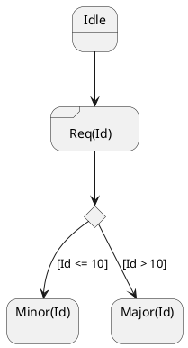

[UP](/plantuml/plantuml-index.html)

The stereotype `<<choice>>` can be used to use conditional state.

```text
@startuml
state "Req(Id)" as ReqId <<sdlreceive>>
state "Minor(Id)" as MinorId
state "Major(Id)" as MajorId
 
state c <<choice>>
 
Idle --> ReqId
ReqId --> c
c --> MinorId : [Id <= 10]
c --> MajorId : [Id > 10]
@enduml
```




