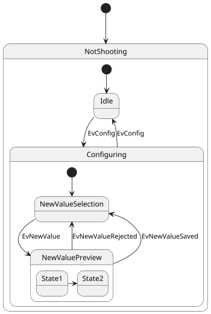
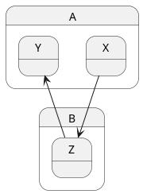

[UP](/plantuml/plantuml-index.html)

A state can also be composite.
You have to define it using the `state` keywords and **brackets**.

## Internal sub-state

```text
@startuml
scale 350 width
[*] --> NotShooting

state NotShooting {
  [*] --> Idle
  Idle --> Configuring : EvConfig
  Configuring --> Idle : EvConfig
}

state Configuring {
  [*] --> NewValueSelection
  NewValueSelection --> NewValuePreview : EvNewValue
  NewValuePreview --> NewValueSelection : EvNewValueRejected
  NewValuePreview --> NewValueSelection : EvNewValueSaved

  state NewValuePreview {
     State1 -> State2
  }

}
@enduml
```



## Sub-state to sub-state

```text
@startuml
state A {
  state X {
  }
  state Y {
  }
}
 
state B {
  state Z {
  }
}

X --> Z
Z --> Y
@enduml
```



```text
@startuml
state A.X
state A.Y
 
state B.Z

X --> Z
Z --> Y
@enduml
```


