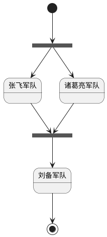

[UP](/plantuml/plantuml-index.html)

You can also fork and join
using the `<<fork>>` and `<<join>>` stereotypes.

```text
@startuml

state fork_state <<fork>>
[*] --> fork_state
fork_state --> 张飞军队
fork_state --> 诸葛亮军队

state join_state <<join>>
张飞军队 --> join_state
诸葛亮军队 --> join_state
join_state --> 刘备军队
刘备军队 --> [*]

@enduml
```




