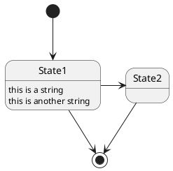
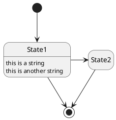

[UP](/plantuml/plantuml-index.html)

```text
@startuml
[*] --> State1
State1 --> [*]
State1 : this is a string
State1 : this is another string

State1 -> State2
State2 --> [*]
@enduml
```



use `hide empty description` to render state as simple box.

```text
@startuml
hide empty description
[*] --> State1
State1 --> [*]
State1 : this is a string
State1 : this is another string

State1 -> State2
State2 --> [*]
@enduml
```


