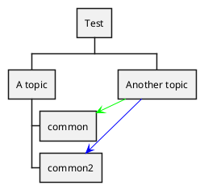
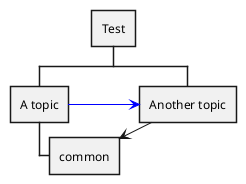

[UP](/plantuml/plantuml-index.html)

## Using alias with `as`:

```text
@startwbs
<style>
.foo {
  LineColor #00FF00;
}
</style>
* Test
** A topic
*** "common" as c1
*** "common2" as c2
** "Another topic" as t2
t2 -> c1 <<foo>>
t2 ..> c2 #blue
@endwbs
```



## Using alias in parentheses

```text
@startwbs
* Test
**(b) A topic
***(c1) common
**(t2) Another topic
t2 --> c1
b -> t2 #blue
@endwbs
```


