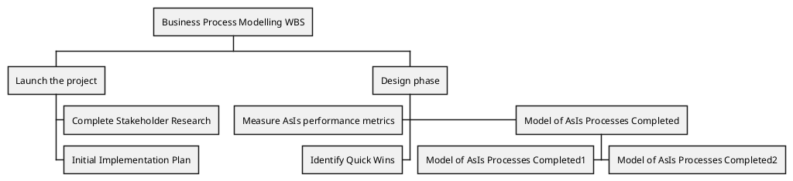

[UP](/plantuml/plantuml-index.html)

## Change direction

You can change direction using `<` and `>`

```text
@startwbs
* Business Process Modelling WBS
** Launch the project
*** Complete Stakeholder Research
*** Initial Implementation Plan
** Design phase
*** Model of AsIs Processes Completed
****< Model of AsIs Processes Completed1
****> Model of AsIs Processes Completed2
***< Measure AsIs performance metrics
***< Identify Quick Wins
@endwbs
```


